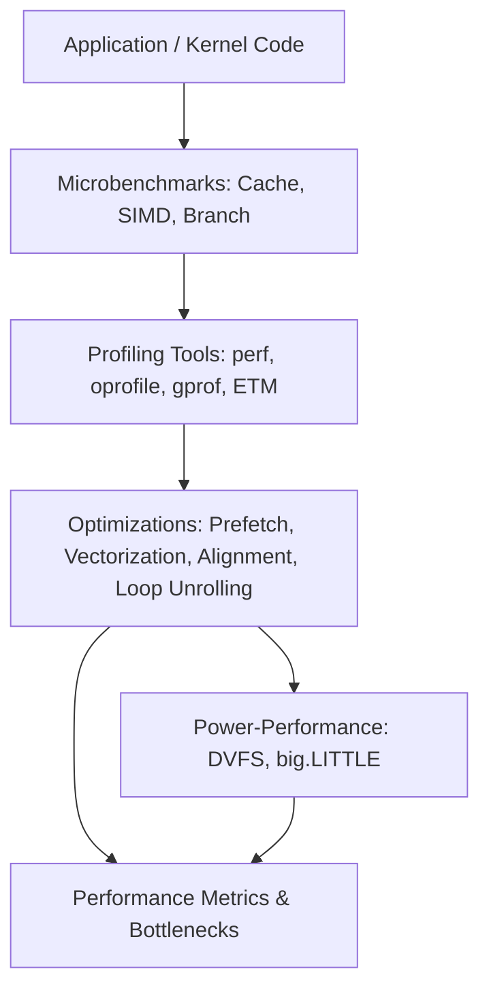

# 10. Performance Tuning & Benchmarks

ARM developers must understand both hardware and software characteristics to optimize performance, manage power, and evaluate workloads.

## 10.1 Microbenchmarks

| Benchmark Type             | Purpose                                                   | Developer Notes                                       |
| -------------------------- | --------------------------------------------------------- | ----------------------------------------------------- |
| **Cache / Memory**         | Measure latency and bandwidth of L1/L2/L3 caches and DRAM | Use `lmbench`, `stream`, or custom memory tests       |
| **SIMD / NEON**            | Evaluate vector processing throughput                     | Focus on alignment, unrolling, and NEON intrinsics    |
| **Branch Predictor**       | Test branch misprediction rates                           | Helps tune code layout and conditional logic          |
| **Pipeline / Instruction** | Measure pipeline stalls and execution unit utilization    | Identify bottlenecks in ALU, FPU, or load/store units |

## 10.2 Profiling Tools

| Tool          | Function                                  | Developer Notes                                         |
| ------------- | ----------------------------------------- | ------------------------------------------------------- |
| **perf**      | Linux performance counters, event tracing | CPU cycles, cache misses, branch mispredicts            |
| **oprofile**  | System-wide profiling                     | Kernel and user-space profiling with low overhead       |
| **gprof**     | Function-level profiling                  | Compile with ` -pg`, useful for hotspots in code         |
| **ETM / ITM** | ARM embedded trace modules                | Cycle-accurate instruction tracing for Cortex-A/M cores |

## 10.3 Optimization Tips

| Technique                  | Use Case                       | Notes                                                         |
| -------------------------- | ------------------------------ | ------------------------------------------------------------- |
| **Prefetching**            | Reduce cache misses            | Manual software prefetch or hardware prefetch tuning          |
| **Vectorization**          | Exploit SIMD / NEON units      | Compiler intrinsics or auto-vectorization                     |
| **Alignment**              | Data alignment for cache lines | Avoid unaligned memory accesses for speed                     |
| **Loop unrolling**         | Improve instruction throughput | Reduces branch overhead in tight loops                        |
| **Core clustering / DVFS** | Power-performance trade-offs   | DynamIQ / big.LITTLE scheduling for optimal energy efficiency |

## 10.4 Power-Performance Trade-offs

* Use **DVFS (Dynamic Voltage and Frequency Scaling)** to tune cores for workload requirements.
* **big.LITTLE scheduling**: Offload tasks between “big” and “LITTLE” cores for energy efficiency.
* Monitor performance-per-watt metrics using counters and `perf`.

## 10.5 Mermaid Diagram: Performance Tuning Workflow

**Developer Notes:**

* Start with microbenchmarks to identify hardware behavior.
* Use profiling to pinpoint hotspots in code and memory access patterns.
* Apply vectorization, prefetching, and alignment for maximum throughput.
* Balance performance with energy efficiency via DVFS and core clustering.
* Continuously measure metrics to validate optimizations.
