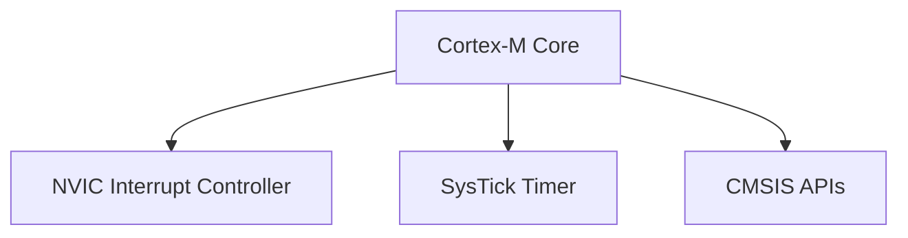
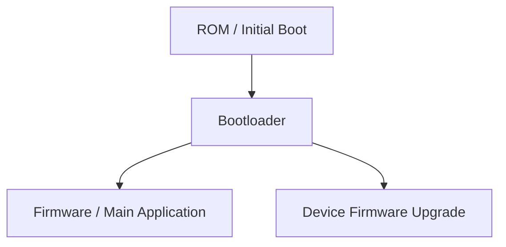
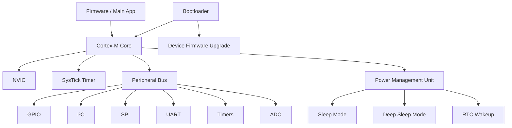

# 11. Embedded & MCU Ecosystem

The ARM Cortex-M series targets microcontroller units (MCUs) for deeply embedded and real-time applications. This chapter details the ecosystem, peripherals, power management, and development workflow.

## 11.1 Cortex-M Series

| Feature       | Description                                                                                        |
| ------------- | -------------------------------------------------------------------------------------------------- |
| **NVIC**      | Nested Vectored Interrupt Controller for flexible interrupt handling.                              |
| **SysTick**   | Timer for system ticks and periodic interrupts.                                                    |
| **CMSIS API** | Cortex Microcontroller Software Interface Standard for consistent peripheral and RTOS integration. |

**Mermaid Diagram: Cortex-M Core Components**

## 11.2 Peripherals & Buses

| Peripheral | Use Case                                            |
| ---------- | --------------------------------------------------- |
| GPIO       | Digital input/output pins for sensors and actuators |
| I²C        | Low-speed inter-device communication                |
| SPI        | High-speed serial communication                     |
| UART       | Serial communication for debugging or telemetry     |
| Timers     | Event timing, PWM generation                        |
| ADC        | Analog-to-digital conversion for sensors            |

## 11.3 Low-Power Design

* **Sleep modes**: CPU halted, peripherals may remain active.
* **Deep sleep**: Minimal power consumption, only critical wakeup sources active.
* **RTC wakeups**: Real-Time Clock can wake MCU from deep sleep.

## 11.4 Bootloaders & DFU

| Mechanism                     | Purpose                                                                        |
| ----------------------------- | ------------------------------------------------------------------------------ |
| Bootloader                    | Initializes MCU hardware and jumps to main firmware                            |
| DFU (Device Firmware Upgrade) | Provides secure, in-field firmware updates over USB, UART, or other interfaces |

**Mermaid Diagram: MCU Boot & DFU Flow**

This chapter equips developers with an overview of the Cortex-M ecosystem, key peripherals, low-power strategies, and boot mechanisms to design robust embedded systems.

## 11.5 Peripheral & Low-Power Flow

**Mermaid Diagram: Cortex-M End-to-End Flow**

This unified diagram shows how the Cortex-M core interacts with peripherals, manages power modes, and integrates the bootloader/DFU flow, giving developers a complete end-to-end view of MCU system operation.