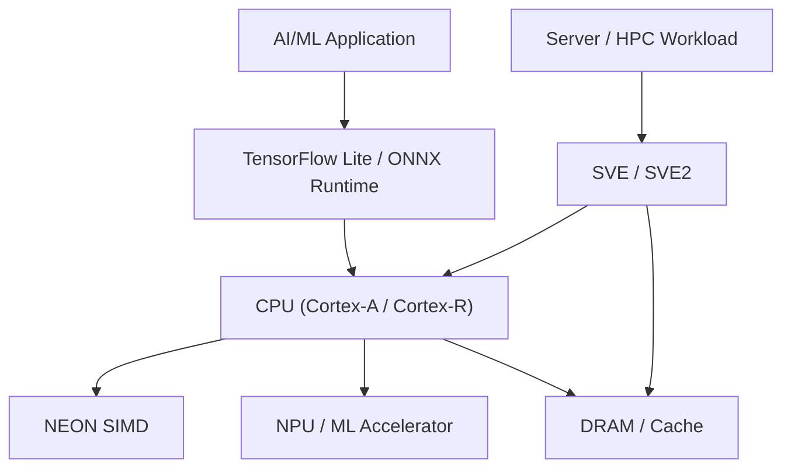

# 12. AI/ML on ARM

ARM provides advanced AI/ML capabilities through SIMD extensions, dedicated accelerators, and scalable vector engines optimized for inference and HPC workloads.

## 12.0 Definitions

* **NEON:** ARM’s SIMD (Single Instruction, Multiple Data) engine for accelerating vector and ML workloads on Cortex-A/R CPUs.
* **NPU (Neural Processing Unit):** Dedicated hardware for ML inference, performing convolutions, matrix multiplications, and other neural network operations efficiently.
* **SVE (Scalable Vector Extension):** ARM’s vectorization technology for CPUs with scalable vector lengths up to 2048 bits. Optimized for HPC and large ML workloads.
* **SVE2:** Extension of SVE adding instructions like matrix multiply, dot product, and other enhanced vector operations for ML/HPC acceleration.

## 12.1 NEON for Machine Learning

| Feature              | Description                                                            |
| -------------------- | ---------------------------------------------------------------------- |
| SIMD Acceleration    | Parallel processing of multiple data elements in a single instruction. |
| Quantized Inference  | Supports int8/int16 for low-power, memory-efficient ML inference.      |
| ML Framework Support | TensorFlow Lite, ONNX Runtime, ARM Compute Library leverage NEON.      |

**Summary:** NEON enables vectorized ML operations on ARM CPUs, ideal for edge devices and low-power inference.

## 12.2 NPUs / ML Accelerators

| Feature                      | Description                                      |
| ---------------------------- | ------------------------------------------------ |
| Dedicated Inference Hardware | Specialized cores for neural network operations. |
| Low-Power AI                 | Efficient edge inference with minimal CPU load.  |
| Integration with SoC         | Connected via AMBA/AXI for fast memory access.   |

**Summary:** NPUs offload ML workloads from CPU, allowing high-performance, energy-efficient inference, suitable for real-time edge AI.

## 12.3 SVE & SVE2

| Feature                         | Description                                                       |
| ------------------------------- | ----------------------------------------------------------------- |
| Scalable Vector Extension (SVE) | Vector lengths scalable up to 2048 bits, ideal for HPC/ML.        |
| SVE2 Enhancements               | Matrix multiply, dot product, and other ML-specific instructions. |
| HPC/Server Focus                | High-throughput vector operations for ML training/inference.      |

**Summary:** SVE/SVE2 accelerates large-scale ML workloads and HPC tasks with flexible vector lengths.

## 12.4 NEON vs NPU vs SVE Comparison (Developer Reference)

| Feature          | NEON                      | NPU                              | SVE/SVE2                                |
| ---------------- | ------------------------- | -------------------------------- | --------------------------------------- |
| Hardware Type    | SIMD engine on CPU        | Dedicated inference core         | CPU vector extension                    |
| Use Case         | Edge ML, mobile inference | Edge AI, real-time inference     | HPC, server ML, large-scale training    |
| Data Precision   | int8/int16/float32        | int8/int16/float32               | int8/int16/float32/FP64                 |
| Memory Access    | CPU cache                 | AXI-connected memory             | CPU cache / DRAM                        |
| Power Efficiency | Moderate                  | High                             | High on HPC servers                     |
| Key Benefit      | Vectorized ML ops         | Offload CPU, real-time inference | Scalable vectorization, high throughput |

## 12.5 ARM AI/ML Execution Flow

**Summary:** The diagram shows how AI/ML workloads traverse from frameworks to CPUs, NEON, NPUs, and memory. Edge inference leverages NEON/NPU, while SVE/SVE2 accelerates large-scale HPC/server ML workloads.

## Developer Tips:

* Use **ARM Compute Library** to utilize NEON/NPU efficiently.
* Profile ML workloads with **perf**, **Tracealyzer**, or vendor-specific NPU profilers.
* Quantize models to **int8** for NEON acceleration and reduced memory usage.
* On SVE/SVE2 hardware, write **vector-length-agnostic (VLA) kernels** for portability.
* Optimize AXI-connected accelerator access to reduce memory latency.
