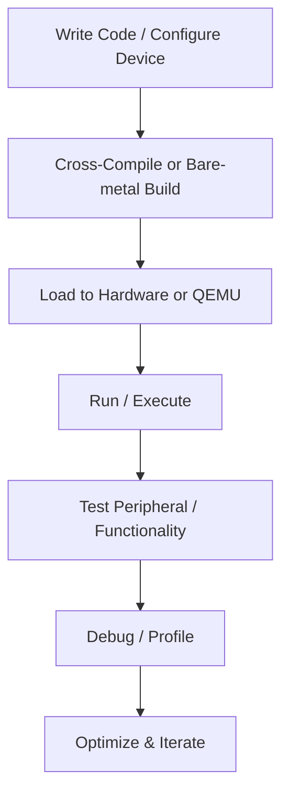

# 13. Hands-on Examples & Recipes

This chapter provides practical ARM development examples, from bare-metal programming to NEON intrinsics, cross-compilation, and device tree modifications. These examples help developers understand low-level ARM programming and peripheral integration.

---

## 13.1 Bare-Metal Blink

**Objective:** Toggle an LED on a microcontroller without an operating system.

**Key Concepts:**

* **Startup Vector:** Entry point that initializes stack and vector table.
* **GPIO Control:** Set/clear pins to toggle LEDs.
* **Infinite Loop:** Keeps MCU running while blinking.

| Step                | Description                                 |
| ------------------- | ------------------------------------------- |
| Startup Vector      | Define `Reset_Handler` and vector table.    |
| GPIO Initialization | Configure GPIO direction and enable output. |
| Toggle LED          | Write to GPIO output register in a loop.    |
| Delay               | Simple software loop or timer-based delay.  |

**Summary:** This demonstrates fundamental MCU control and how to manipulate peripherals directly.
```c
/* Bare-metal LED Blink for ARM Cortex-M */

#include <stdint.h>

/* Define base addresses for GPIO (STM32F0 as example) */
#define RCC_AHBENR   (*(volatile uint32_t*)0x40021014)
#define GPIOC_MODER  (*(volatile uint32_t*)0x48000800)
#define GPIOC_ODR    (*(volatile uint32_t*)0x48000814)

#define LED_PIN 8  // PC8

/* Simple delay */
void delay(volatile uint32_t count) {
    while(count--) { __asm("nop"); }
}

/* Reset handler (entry point) */
void Reset_Handler(void) {
    /* Enable GPIOC clock (AHBENR bit 19) */
    RCC_AHBENR |= (1 << 19);

    /* Set PC8 as output (MODER bits 16-17 = 01) */
    GPIOC_MODER &= ~(0x3 << (LED_PIN * 2));
    GPIOC_MODER |=  (0x1 << (LED_PIN * 2));

    while(1) {
        /* Toggle LED */
        GPIOC_ODR ^= (1 << LED_PIN);
        delay(500000);
    }
}

/* Vector table placed at start of flash */
**attribute**((section(".isr_vector")))
void (* const vector_table[])(void) = {
    (void (*)(void))0x20002000,  // Initial Stack Pointer
    Reset_Handler,               // Reset Handler
};
```
### Code Flow

1. MCU resets → Stack pointer initialized → Reset handler runs.
2. GPIO clock enabled → LED pin configured as output.
3. MCU enters infinite loop → LED toggles → delay applied.
4. Process repeats → Visible LED blinking.

**Tip:** For precise timing, use hardware timers instead of software delay.

---

## 13.2 Cross-Compile & Run on QEMU

**Objective:** Compile a simple ARM program and run it in a QEMU emulator.

**Steps:**

1. **Toolchain Setup:** Install ARM GCC cross-compiler (`arm-none-eabi-gcc`).
2. **Write Code:** Simple “Hello ARM” program.
3. **Compile:** Use ` -mcpu`, ` -march`, and ` -mthumb` flags.
4. **Run in QEMU:** Emulate Cortex-M/A hardware.

| Command  | Example                                                          |
| -------- | ---------------------------------------------------------------- |
| Compile  | `arm-none-eabi-gcc -mcpu=cortex-m4 -mthumb hello.c -o hello.elf` |
| QEMU Run | `qemu-system-arm -M stm32-p103 -kernel hello.elf -nographic`     |

**Summary:** QEMU allows rapid prototyping without hardware, ideal for testing and debugging early development stages.

---

## 13.3 NEON Intrinsics Example

**Objective:** Perform SIMD vector addition using NEON intrinsics.

**Key Concepts:**

* **NEON Registers:** 128-bit vectors for parallel operations.
* **Intrinsics:** Compiler-provided functions mapping directly to NEON instructions.
* **Vector Addition:** Adds multiple data elements simultaneously.

**Example:**

```c
#include <arm_neon.h>
int32x4_t a = {1,2,3,4};
int32x4_t b = {5,6,7,8};
int32x4_t result = vaddq_s32(a,b); // Parallel addition
```

| Step             | Explanation                                  |
| ---------------- | -------------------------------------------- |
| Include Header   | `<arm_neon.h>` provides NEON intrinsics.     |
| Define Vectors   | Initialize 128-bit integer vectors.          |
| Perform Addition | Use `vaddq_s32` to add vectors element-wise. |
| Result           | 4 parallel sums computed in one instruction. |

**Summary:** NEON intrinsics accelerate numerical workloads and demonstrate SIMD programming on ARM.

---

## 13.4 Device Tree Node Example

**Objective:** Add a new peripheral entry in a Device Tree source (DTS).

**Key Concepts:**

* **Device Tree:** Describes hardware to the OS.
* **Node:** Represents a device.
* **Properties:** Define addresses, interrupts, and configuration.

**Example DTS Snippet:**

```dts
my_led: led@50000000 {
    compatible = "vendor,led";
    reg = <0x50000000 0x1000>;
    gpio = <&gpio1 5 0>;
};
```

| Field          | Description                         |
| -------------- | ----------------------------------- |
| `my_led`       | Node label.                         |
| `led@50000000` | Device address.                     |
| `compatible`   | Driver match string.                |
| `reg`          | Base address and size.              |
| `gpio`         | GPIO controller, pin number, flags. |

**Summary:** Device Tree nodes allow developers to describe peripherals in a hardware-independent manner, enabling OS and driver recognition.

---

## 13.5 Hands-On Workflow




**Summary:** The diagram shows a practical workflow for ARM developers combining coding, compilation, execution, testing, and optimization.

# 13.6 Combined Hands-On ARM Recipes Table

| Example                        | Objective                                 | Key Concepts                                          | Steps / Commands                                                                                                                                                                                        | Developer Notes                                                                                                                 |
| ------------------------------ | ----------------------------------------- | ----------------------------------------------------- | ------------------------------------------------------------------------------------------------------------------------------------------------------------------------------------------------------- | ------------------------------------------------------------------------------------------------------------------------------- |
| **Bare-Metal LED Blink**       | Toggle an LED on MCU                      | Startup vector, GPIO, infinite loop, delay            | 1. Define `Reset_Handler` and vector table<br>2. Configure GPIO as output<br>3. Toggle pin in loop with software delay                                                                                  | Essential for understanding MCU startup, peripheral access, and timing loops. Test on real hardware.                            |
| **Cross-Compile & QEMU**       | Run a simple ARM program without hardware | Cross-compilation, toolchain, emulation               | 1. Install ARM GCC (`arm-none-eabi-gcc`)<br>2. Write “Hello ARM” C program<br>3. Compile with `-mcpu=cortex-mX -mthumb`<br>4. Run on QEMU: `qemu-system-arm -M stm32-p103 -kernel hello.elf -nographic` | Use QEMU for rapid testing, debugging, and early prototyping before deploying to real hardware.                                 |
| **NEON Intrinsics Vector Add** | SIMD acceleration example                 | NEON SIMD, vector registers, intrinsics               | 1. Include `<arm_neon.h>`<br>2. Initialize vectors: `int32x4_t a, b`<br>3. Perform addition: `vaddq_s32(a,b)`<br>4. Use results in further computation                                                  | Demonstrates ARM NEON for parallel data processing. Ideal for DSP, ML inference, or signal processing.                          |
| **Device Tree Node Addition**  | Describe new peripheral to OS             | Device Tree syntax, node, properties, GPIO            | 1. Add DTS snippet for peripheral<br>2. Set `compatible`, `reg`, `gpio` properties<br>3. Compile DTS to DTB and load in kernel<br>4. Verify with `/proc/device-tree`                                    | Device Tree ensures OS recognizes custom hardware. Key for embedded Linux drivers and peripheral management.                    |
| **Full ARM Workflow**          | End-to-end development                    | Code → Compile → Load → Run → Test → Debug → Optimize | 1. Write code (bare-metal or OS)<br>2. Compile or cross-compile<br>3. Load to hardware / QEMU<br>4. Execute and test<br>5. Debug and profile<br>6. Optimize performance                                 | Shows iterative development cycle. Encourages testing, profiling, and optimization. Essential for professional ARM development. |

---

## Summary

This table consolidates the main ARM hands-on examples and recipes for developers:

* **Bare-metal LED blink**: Core MCU understanding.
* **Cross-compilation & QEMU**: Early development and debugging.
* **NEON intrinsics**: Performance optimization with SIMD.
* **Device Tree modification**: Hardware abstraction for OS.
* **Workflow diagram**: Integrates all stages for a practical ARM development process.

It provides a **quick reference** for ARM developers, combining low-level MCU programming, OS-aware programming, SIMD optimization, and peripheral configuration in one view.


---

**Developer Tips:**

* Always start with a small peripheral example like LED blink.
* Use QEMU for testing before hardware deployment.
* Leverage NEON for vectorized operations to improve performance.
* Carefully maintain Device Tree consistency when adding new peripherals.
* Integrate iterative testing and debugging for reliable embedded software.

