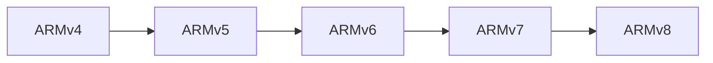
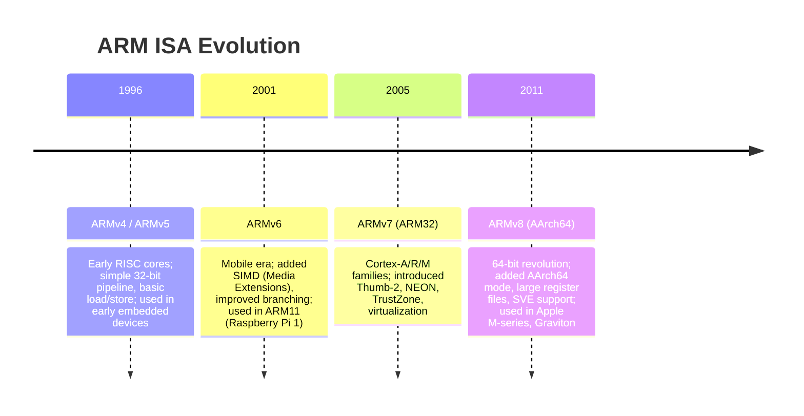
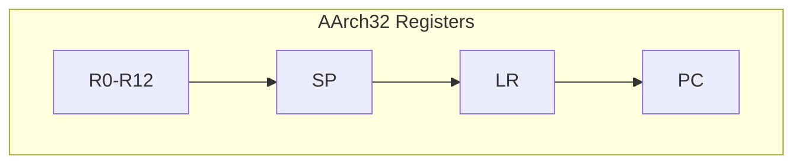
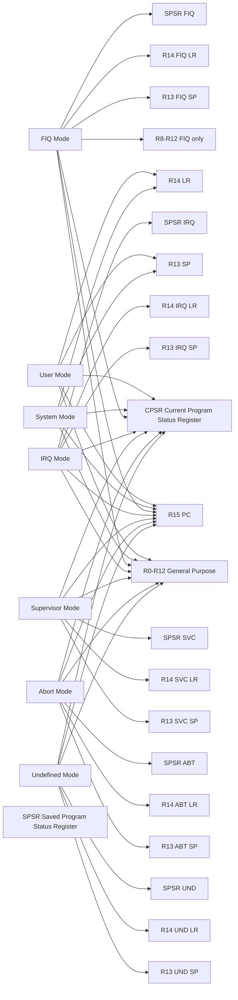
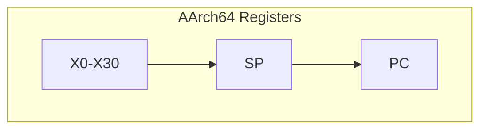
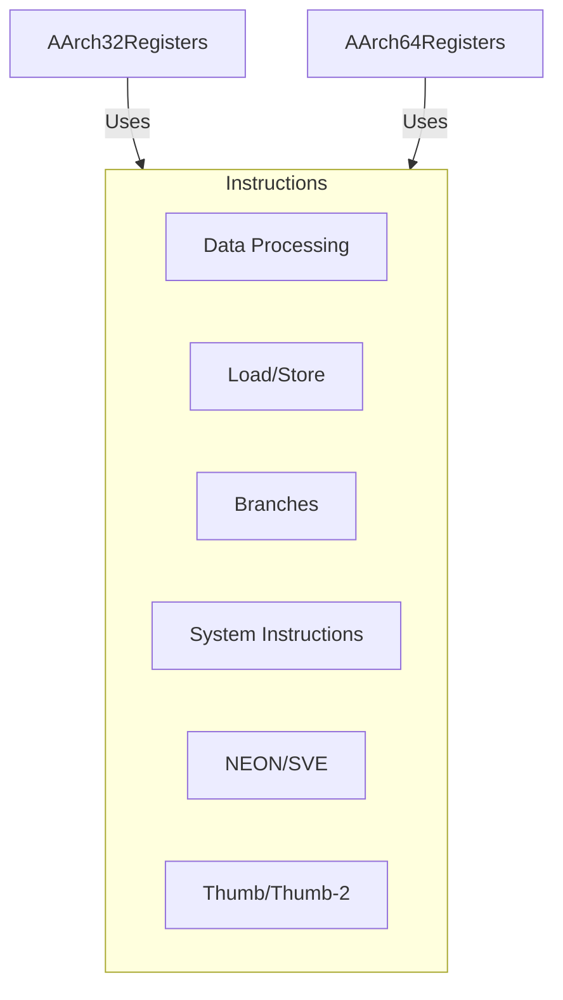
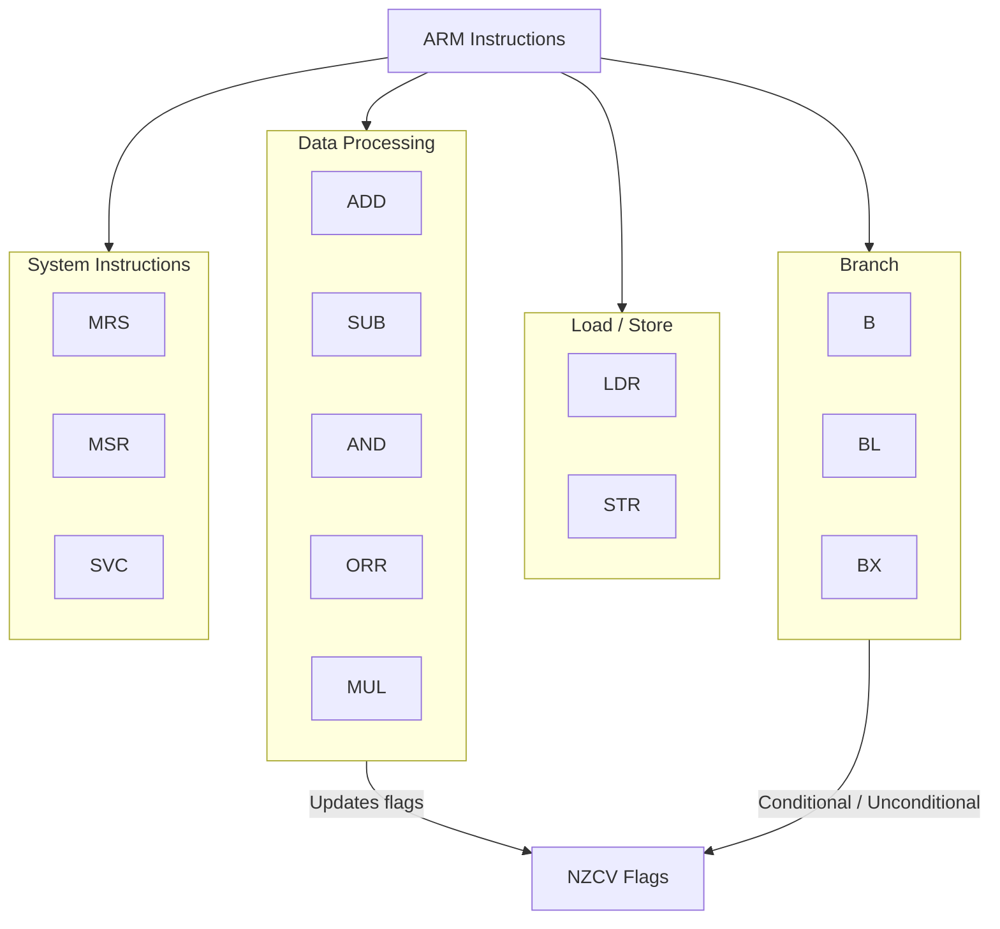
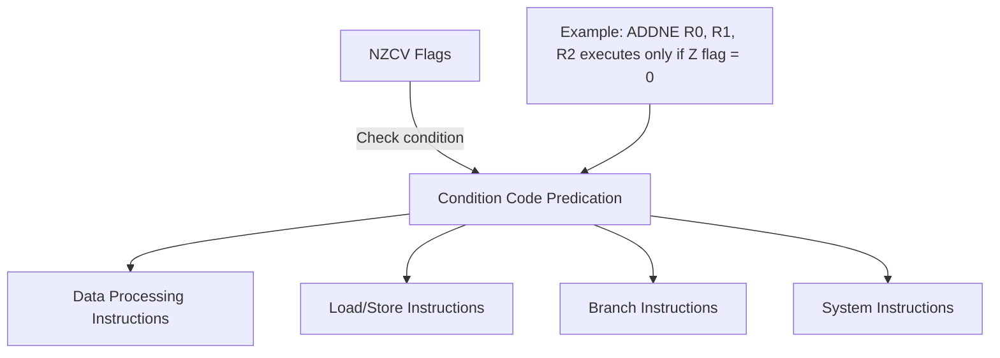

# Chapter 2: ARM ISA (Instruction Set Architecture)

## Overview

The **ARM Instruction Set Architecture (ISA)** defines how ARM processors execute software — from basic arithmetic to advanced parallel workloads.  
Over time, the ISA has evolved to meet the demands of higher performance, energy efficiency, and modern workloads such as AI, graphics, and high-performance computing.

## 2.1 ARM ISA Generations

ARM has evolved through multiple generations, improving performance, features, and addressing new workloads. The major generations are:

| Generation | Architecture | Key Features |
|-------------|---------------|---------------|
| **ARMv4 / v5** | Early RISC cores | Simple 32-bit pipeline, basic load/store, used in early embedded devices |
| **ARMv6** | Mobile era | Added SIMD (Media Extensions), improved branching, used in ARM11 (Raspberry Pi 1) |
| **ARMv7 (ARM32)** | Cortex-A/R/M families | Introduced Thumb-2, NEON, TrustZone, and virtualization |
| **ARMv8 (AArch64)** | 64-bit revolution | Added AArch64 mode, large register files, SVE support, used in Apple M-series, Graviton, etc. |

---

## 2.2 AArch32 vs AArch64

| Feature | **AArch32 (ARMv7)** | **AArch64 (ARMv8+)** |
|----------|--------------------|----------------------|
| Register Width | 32-bit | 64-bit |
| General Registers | 16 (R0–R15) | 31 (X0–X30) + SP |
| Instruction Width | Mostly 32-bit (some 16-bit via Thumb) | Fixed 32-bit |
| Address Space | 4 GB | 16 Exabytes |
| Calling Convention | AAPCS | AAPCS64 |
| Execution States | ARM, Thumb, Jazelle | AArch32, AArch64 |

- **AArch32**: Legacy 32-bit mode for backward compatibility.
- **AArch64**: 64-bit mode, larger registers, improved performance, enhanced security.

AArch64 modernized the design for servers and high-end systems, while maintaining AArch32 compatibility for legacy and embedded workloads.

## 2.3 Instruction Types

ARM instructions are **orthogonal** — most operations can use any register or addressing mode. 
ARM instructions are broadly categorized as:
- **Data Processing**: Arithmetic, logical, and bitwise operations.  
- **Load/Store**: Access memory (LDR, STR).  
- **Branch**: Conditional and unconditional jumps (B, BL, BX).  
- **System Instructions**: Control system registers, exceptions, and synchronization.  

---

## 2.4 Thumb & Thumb-2

- **Thumb**: 16-bit compressed instructions to reduce code size - for efficiency in memory-constrained devices.     
- **Thumb-2** combines 16- and 32-bit instructions, balancing compactness and performance — a hallmark of **Cortex-M** and **Cortex-A** processors.

---
## 2.5 NEON (SIMD)

The **NEON** engine provides **Single Instruction, Multiple Data (SIMD)** capabilities for parallel processing of multimedia and ML workloads — ideal for image, audio, and matrix operations. In short:
- ARM’s SIMD (Single Instruction, Multiple Data) extension.  
- Accelerates multimedia, signal processing, and machine learning workloads.  
- Works on 64-bit and 128-bit vector registers.  

---
## 2.6 SVE / SVE2
**Scalable Vector Extension (SVE)** and **SVE2** extend ARM’s SIMD model with **variable vector lengths (128–2048 bits)**. 
- **SVE (Scalable Vector Extension)**: Designed for HPC and AI workloads.  
- **SVE2**: Adds enhanced SIMD functionality, better vectorization, and more flexible register lengths.  

---
## 2.7 Conditional Execution & Predication

ARM’s hallmark feature is **conditional execution**, which allows most instructions to execute based on the status of **condition flags** (Negative, Zero, Carry, Overflow — NZCV). This feature reduces the need for frequent branching, improving pipeline efficiency and code density. Each instruction can be predicated using **condition codes** such as `EQ` (equal), `NE` (not equal), `GT` (greater than), `LT` (less than), etc. For example, the instruction:

`ADDNE R0, R1, R2`

will add `R1` and `R2` and store the result in `R0` only if the `Zero flag (Z)` is clear, i.e., the previous operation did not result in zero.Predication can be applied to data processing, load/store, and branch instructions, allowing fine-grained control over execution flow without explicit branching instructions.

This diagram shows that **all major instruction types can be predicated** on condition codes derived from the NZCV flags, enabling conditional execution without explicit branches and improving performance.

---

## 2.8 Exception and Interrupt Model

ARM CPUs implement a **hierarchical exception model** with multiple privilege levels, known as **Exception Levels (EL)**:

| Exception Level | Privilege | Typical Use |
|------------------|------------|--------------|
| **EL0** | User | Application code |
| **EL1** | Kernel | OS and drivers |
| **EL2** | Hypervisor | Virtualization |
| **EL3** | Secure Monitor | TrustZone secure world |

Each level maintains its own **vector table** and **stack pointer**, allowing fine-grained control over interrupt handling, security, and virtualization.

## 2.9 AArch64 Register Map (Reference)
| Register | Purpose                                           |
|----------|--------------------------------------------------|
| X0-X7    | Argument / result registers                      |
| X8       | Indirect result / intra-procedure scratch       |
| X9-X15   | Temporary registers                              |
| X16-X17  | Intra-procedure call scratch                     |
| X18      | Platform register (sometimes reserved)          |
| X19-X28  | Callee-saved registers                           |
| X29      | Frame pointer (FP)                               |
| X30      | Link register (LR)                               |
| SP       | Stack pointer                                    |
| PC       | Program counter                                  |
| NZCV     | Condition flags (Negative, Zero, Carry, Overflow) |

---

In essence, the ARM ISA represents a **balance between simplicity and scalability** — powering everything from microcontrollers to supercomputers with the same clean, efficient instruction foundation.
