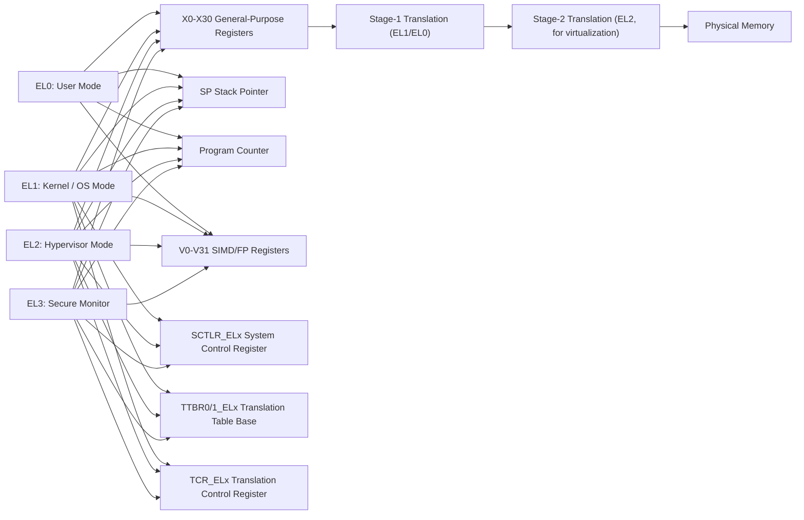
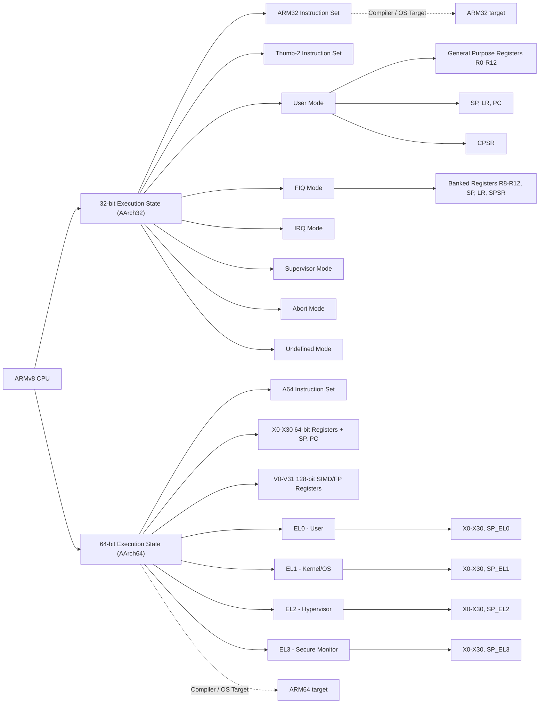

# Chapter 3: ARMv8 / AArch64 Details

---

## 3.1 Register File

- AArch64 has **31 general-purpose registers** (`X0–X30`).  
- **SP (Stack Pointer)** is separate and can be used in instructions like `ADD SP, SP, #16`.  
- **PC (Program Counter)** is not directly accessible as a general-purpose register.  
- SIMD / Floating-point registers: **V0–V31**, 128-bit wide, used for NEON and SVE operations.  

```asm
Example: using general-purpose registers
ADD X0, X1, X2   ; X0 = X1 + X2
LD1 {V0.4S}, [X1] ; Load SIMD vector
```

---

## 3.2 Exception Levels (EL)

ARMv8 introduces **four exception levels** to separate privilege modes:

| EL  | Purpose                  |
|-----|--------------------------|
| EL0 | User mode                |
| EL1 | Kernel / OS mode         |
| EL2 | Hypervisor mode          |
| EL3 | Secure monitor (TrustZone) |

- Each level has its own **SPSR_ELx** and can use banked system registers.  
- Exceptions cause a switch to higher EL with proper **vector table** handling.  

---

## 3.3 System Registers & Translation

Key system registers for control and memory translation:

- **SCTLR_ELx** — System Control Register (enables/disables MMU, caches, alignment checks).  
- **TTBR0_ELx, TTBR1_ELx** — Translation Table Base Registers, hold page table addresses.  
- **TCR_ELx** — Translation Control Register, defines address size and granule size.  

```asm
MRS X0, SCTLR_EL1    ; Read System Control Register
MSR SCTLR_EL1, X0    ; Write to System Control Register
```

- These registers configure **memory translation, caching, and access permissions**.  

---

## 3.4 Memory Model

- ARMv8 uses **release-acquire memory semantics**.  
- **Memory barriers** ensure ordering:

| Instruction | Purpose |
|-------------|---------|
| DMB         | Data Memory Barrier |
| DSB         | Data Synchronization Barrier |
| ISB         | Instruction Synchronization Barrier |

```asm
DMB SY       ; Ensure all memory accesses complete before next instruction
DSB ISH      ; Ensure all instructions and memory complete
ISB          ; Flush pipeline and synchronize instruction stream
```

---

## 3.5 Virtualization Extensions

- Stage-2 translation for **guest physical addresses** in virtualized environments.  
- **EL2 traps** allow hypervisor to control access to resources.  
- Enables **hardware-assisted virtualization** with minimal overhead.  

---

## 3.6 Pointer Authentication (PAC)

- Protects **return addresses and pointers** against modification attacks.  
- PAC instructions compute a **cryptographic signature** of a pointer and verify it on use.  

```asm
AUTIA X30, SP      ; Authenticate return address in X30 using SP as context
PACIASP X29       ; Sign pointer X29 using SP as context
```

---

## 3.7 Branch Target Identification (BTI)

- Enforces **control-flow integrity** by marking valid branch targets.  
- Prevents **jumping into arbitrary instructions** (e.g., against ROP attacks).  
- Used in combination with **PAC** for stronger security guarantees.  

```asm
BTI c             ; Branch target identification hint for indirect branches
```

##Diagram: AArch64 Exception Levels & Registers



---
## Table of all AArch64 (ARM64) registers, including general-purpose, special, and SIMD/FP registers, along with their roles:
| Register(s) | Type                       | Purpose / Notes                                      | Category |
|------------|----------------------------|-----------------------------------------------------|----------|
| X0–X7     | General-Purpose             | Argument / result registers                          | General-Purpose |
| X8        | General-Purpose             | Indirect result / intra-procedure scratch           | General-Purpose |
| X9–X15    | General-Purpose             | Temporary registers                                  | General-Purpose |
| X16–X17   | General-Purpose             | Intra-procedure call scratch                         | General-Purpose |
| X18       | General-Purpose             | Platform register / reserved                         | General-Purpose |
| X19–X28   | General-Purpose             | Callee-saved registers                                | General-Purpose |
| X29       | General-Purpose             | Frame pointer (FP)                                    | General-Purpose |
| X30       | General-Purpose             | Link register (LR)                                    | General-Purpose |
| SP        | Stack Pointer               | Stack pointer                                        | Special-Purpose |
| PC        | Program Counter             | Instruction pointer                                  | Special-Purpose |
| NZCV      | Condition flags             | Negative, Zero, Carry, Overflow                     | Special-Purpose |
| V0–V31    | SIMD / Floating-Point       | 128-bit vector registers (NEON / SVE)               | General-Purpose / SIMD |
| FPSR      | Floating-Point Status Reg   | Flags for floating-point operations                 | Special-Purpose |
| FPCR      | Floating-Point Control Reg  | Control register for FP/SIMD behavior               | Control Register |
| SPSR_ELx  | Saved Program Status        | Holds CPSR state when an exception occurs at ELx    | System Register |
| ELR_ELx   | Exception Link Register     | Holds return address for exception at ELx          | System Register |
| SP_ELx    | Stack Pointer per EL        | SP for each Exception Level (EL0–EL3)               | System Register |
| CurrentEL | System register             | Indicates current Exception Level                   | System Register |
| DAIF      | Interrupt mask flags        | Debug, SError, IRQ, FIQ masks                        | System Register |
| SCR_EL3   | Secure Configuration Reg    | Controls secure monitor features                     | Control Register |
| SCTLR_ELx | System Control Register     | MMU, caches, alignment, execution state control     | Control Register |
| TTBR0_ELx | Translation Table Base Reg  | Base of page table for stage-1 translation          | Control Register |
| TTBR1_ELx | Translation Table Base Reg  | Optional second base table for stage-1 translation | Control Register |
| TCR_ELx   | Translation Control Reg     | Defines translation size, granule, region attributes| Control Register |

## Notes on Categories:
- **General-Purpose**: Used by programs for arithmetic, logic, pointers, or SIMD.
- **Special-Purpose**: Registers like SP, PC, and FPSR/NZCV that are not general-purpose but essential for execution state.
- **System Register**: Used by exception handling or kernel/EL management (e.g., SPSR_ELx, ELR_ELx, CurrentEL).
- **Control Register**: Used for configuring system features, MMU, memory translation, and execution state (e.g., SCTLR_ELx, TTBR, TCR).

---
## Table of all ARM32 (AArch32) register table including general-purpose, special-purpose, and system/control registers
| Register(s) | Type                       | Purpose / Notes                                      | Category |
|------------|----------------------------|-----------------------------------------------------|----------|
| R0–R12    | General-Purpose             | Used for arguments, results, temporary calculations | General-Purpose |
| R13       | Stack Pointer (SP)          | Stack pointer, mode-specific (banked)              | Special-Purpose |
| R14       | Link Register (LR)          | Stores return address, mode-specific (banked)      | Special-Purpose |
| R15       | Program Counter (PC)        | Instruction pointer                                 | Special-Purpose |
| CPSR      | Current Program Status Reg  | Holds condition flags, mode bits, interrupt masks   | Special-Purpose |
| SPSR      | Saved Program Status Reg    | Saved CPSR for exception modes (banked per mode)   | System Register |
| R8–R12_fiq | General-Purpose Banked      | Banked registers only accessible in FIQ mode       | General-Purpose / Banked |
| R13_fiq   | Stack Pointer (FIQ mode)    | Banked SP for FIQ                                   | Special-Purpose / Banked |
| R14_fiq   | Link Register (FIQ mode)    | Banked LR for FIQ                                   | Special-Purpose / Banked |
| R13_irq   | Stack Pointer (IRQ mode)    | Banked SP for IRQ                                   | Special-Purpose / Banked |
| R14_irq   | Link Register (IRQ mode)    | Banked LR for IRQ                                   | Special-Purpose / Banked |
| R13_svc   | Stack Pointer (SVC mode)    | Banked SP for Supervisor mode                       | Special-Purpose / Banked |
| R14_svc   | Link Register (SVC mode)    | Banked LR for Supervisor mode                       | Special-Purpose / Banked |
| R13_abt   | Stack Pointer (Abort mode)  | Banked SP for Abort mode                             | Special-Purpose / Banked |
| R14_abt   | Link Register (Abort mode)  | Banked LR for Abort mode                             | Special-Purpose / Banked |
| R13_und   | Stack Pointer (Undefined)   | Banked SP for Undefined mode                        | Special-Purpose / Banked |
| R14_und   | Link Register (Undefined)   | Banked LR for Undefined mode                        | Special-Purpose / Banked |
| SPSR_fiq  | Saved Program Status Reg (FIQ)| Saved CPSR for FIQ mode                             | System Register |
| SPSR_irq  | Saved Program Status Reg (IRQ)| Saved CPSR for IRQ mode                             | System Register |
| SPSR_svc  | Saved Program Status Reg (SVC)| Saved CPSR for Supervisor mode                      | System Register |
| SPSR_abt  | Saved Program Status Reg (ABT)| Saved CPSR for Abort mode                            | System Register |
| SPSR_und  | Saved Program Status Reg (UND)| Saved CPSR for Undefined mode                        | System Register |
## Notes on ARM32 Registers

- **R0–R12** are general-purpose registers used for **function arguments, temporary values, and computation**.
- **R13 (SP), R14 (LR), R15 (PC)** are **special-purpose registers**.
- **CPSR** holds **condition flags, execution mode, and interrupt masks**.
- **SPSR** is **mode-specific** and saves CPSR when entering exceptions.
- **Banked registers** allow **fast context switching** for exception modes: **FIQ, IRQ, Supervisor, Abort, Undefined**.


## ARMv8 Execution States and Exception Levels


## Explanation

#### AArch32 (32-bit)

- **Modes:** User, FIQ, IRQ, Supervisor, Abort, Undefined  
- **Banked Registers:** Uses banked registers in exception modes for SP, LR, and some R8–R12 (FIQ only)  
- **Registers:** 32-bit general-purpose registers (R0–R15), CPSR/SPSR  

#### AArch64 (64-bit)

- **Exception Levels (EL0–EL3):**  
  - EL0 → User mode  
  - EL1 → Kernel / OS  
  - EL2 → Hypervisor  
  - EL3 → Secure Monitor  
- **Registers:**  
  - General-purpose: X0–X30 (64-bit)  
  - Stack pointer: SP_ELx (per EL)  
  - Program counter: PC  
  - SIMD/FP registers: V0–V31 (128-bit)  
- **Banking:** Each EL has its own SP and SPSR  

#### Platform / Compiler Context

- **ARM32:** Target for 32-bit OS  
- **ARM64:** Target for 64-bit OS running AArch64 instructions

