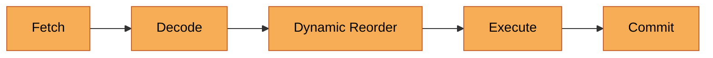
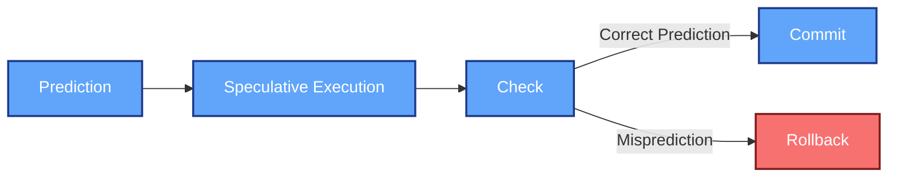
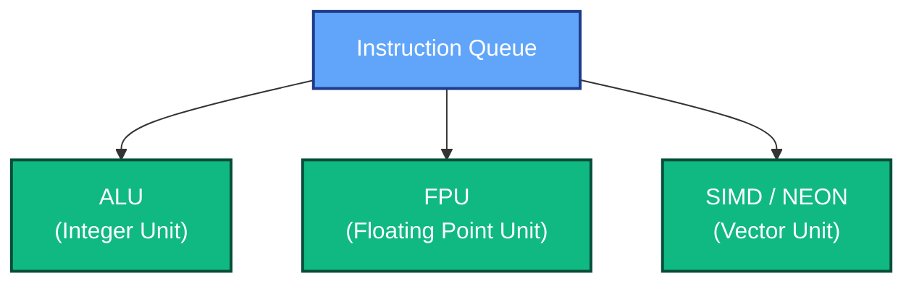
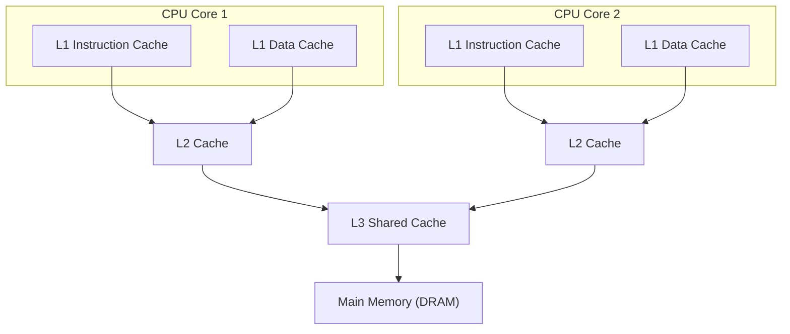
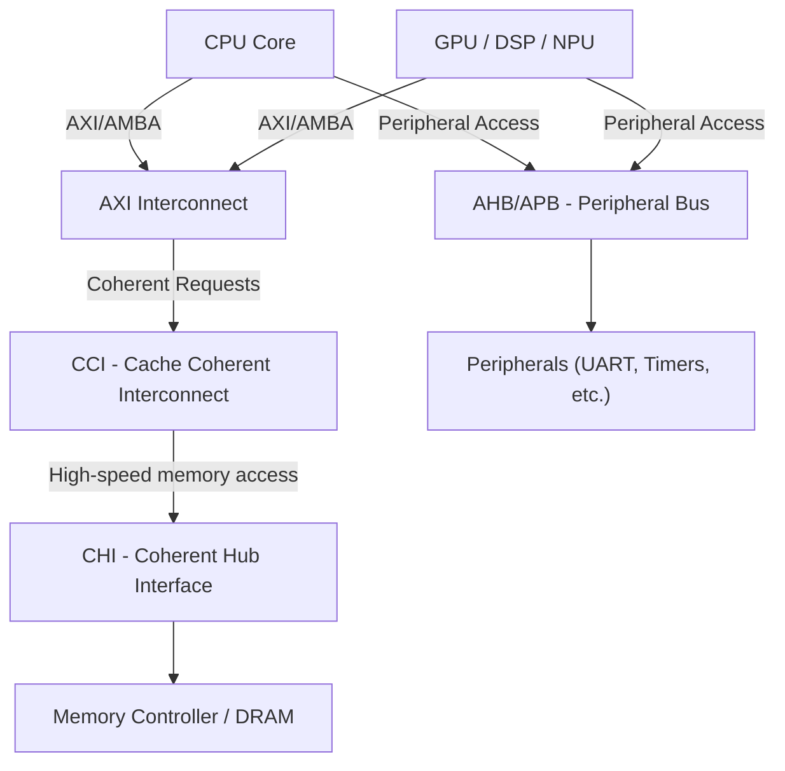
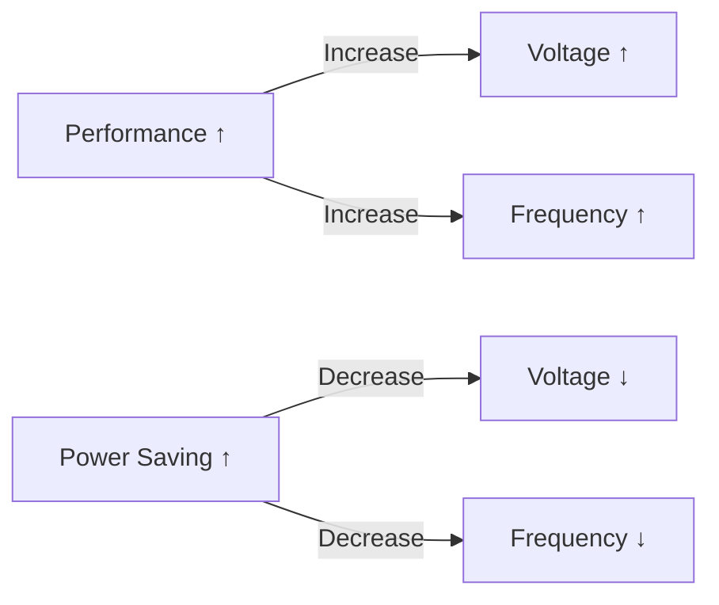

# 4. Microarchitecture & Implementation

## 4.1 In-Order vs. Out-of-Order Cores
Microarchitectural design decisions significantly influence CPU performance, power, and area efficiency.  
- **In-order cores** (e.g., *ARM Cortex-A5, Cortex-A7*) execute instructions sequentially as they appear in the instruction stream. This approach minimizes design complexity and power consumption but limits instruction-level parallelism (ILP).  
- **Out-of-order cores** (e.g., *Cortex-A76, Cortex-X1*) dynamically reorder instruction execution to utilize idle functional units and hide latencies. While offering higher throughput, these designs require complex scheduling, dependency tracking, and larger buffers, increasing area and power.

| Core Type        | Example Cores     | Execution Style       | Advantages                        | Limitations |
|------------------|------------------|-----------------------|-----------------------------------|--------------|
| **In-Order**     | Cortex-A5, A7    | Executes sequentially | Low power, simpler design         | Lower IPC, stalls on dependencies |
| **Out-of-Order** | Cortex-A76, X1   | Reorders dynamically  | High performance, hides latency   | More complex, higher power |

### In-Order vs Out-of-Order Execution (Visualization)

### In-Order Core

### Out-of-Order Core

Out-of-order cores dynamically reorder instructions to utilize idle units, while in-order cores follow strict sequential flow.

---

## 4.2 Pipeline Stages
Modern CPU pipelines divide instruction execution into multiple stages to maximize clock frequency and throughput. Typical stages include:

1. **Fetch** – Retrieve instructions from the instruction cache or memory.  
2. **Decode** – Translate instructions into micro-operations (µops).  
3. **Rename** – Map logical to physical registers, eliminating false dependencies.  
4. **Dispatch** – Send µops to available execution units.  
5. **Execute** – Perform arithmetic, logical, memory, or control operations.  
6. **Commit (Retire)** – Update architectural state in order and handle exceptions.

Deep pipelines (10–20 stages) are common in high-performance cores, while simpler microcontrollers may use 3–5 stages.

### Modern CPU Pipeline Overview

---

## 4.3 Superscalar Execution & Speculation
**Superscalar architectures** issue and execute multiple instructions per cycle by replicating execution units.  
To maintain high utilization, CPUs employ **branch prediction** and **speculative execution**:

- **Branch Prediction:** Predicts instruction flow across conditional branches using dynamic or static predictors (e.g., 2-bit saturating counters, global history).  
- **Speculative Execution:** Executes predicted paths ahead of time. Incorrect predictions are squashed, and architectural state is rolled back.  
- **Recovery Mechanisms:** Reorder buffers (ROB) and checkpointing are used to restore processor state upon misprediction.

These techniques improve performance but require robust handling to mitigate vulnerabilities like Spectre and Meltdown.
### Branch Prediction Workflow

- **Dynamic predictors** use history tables and saturating counters.
- **Speculation recovery** uses Reorder Buffers (ROB) and checkpoints.
- **Vulnerability note:** Improper speculation handling can lead to side-channel attacks (e.g., *Spectre*).

---

## 4.4 Execution Units
Execution units carry out the actual computational work of the processor:

- **ALU (Arithmetic Logic Unit):** Handles integer arithmetic, logic, and bitwise operations.  
- **Load/Store Units:** Manage memory access, addressing, and cache interactions.  
- **FPU (Floating Point Unit):** Executes floating-point operations compliant with IEEE 754.  
- **SIMD/NEON Units:** Perform vectorized data-parallel operations for multimedia, AI, and DSP workloads.  

| Unit Type | Function | Example Operations |
|------------|-----------|-------------------|
| **ALU** | Integer arithmetic and logic | ADD, AND, OR, XOR |
| **Load/Store** | Memory access and address generation | LDR, STR |
| **FPU** | Floating-point arithmetic | ADD.S, MUL.D |
| **SIMD/NEON** | Vectorized data-parallel operations | QADD, VMLA, VADD |

Modern cores feature multiple ALUs and vector pipelines operating concurrently to sustain high IPC (Instructions Per Cycle).

### Simplified Execution Units Diagram

---

## 4.5 Cache Hierarchy
To bridge the speed gap between CPU and memory, modern processors employ multi-level caches:

- **L1 Cache:** Small, per-core, split instruction and data caches (e.g., 32–64 KB each).  
- **L2 Cache:** Larger unified per-core cache (256 KB–1 MB).  
- **L3 Cache (Last Level Cache):** Shared among cores (up to several MBs).  

CPUs use hierarchical caches to reduce memory access latency.

| Level | Typical Size | Location | Purpose |
|--------|---------------|----------|----------|
| **L1** | 32–64 KB (per core) | Split I/D | Fastest, for current instructions/data |
| **L2** | 256 KB–1 MB (per core) | Unified | Stores recent data shared by L1 |
| **L3** | 2–16 MB (shared) | Shared among cores | Reduces main memory traffic |

Coherence between caches is maintained using protocols such as **MESI** (Modified, Exclusive, Shared, Invalid) or **MOESI** (adds Owned state).  
These ensure data consistency across cores in multi-core systems.

**Coherence Protocols:**

- **MESI:** Modified, Exclusive, Shared, Invalid  
- **MOESI:** Adds "Owned" state for shared dirty lines  

### **Cache Hierarchy Diagram**

#### Diagram Explanation

- **L1 I/D Caches**: Each core has fast private instruction and data caches.  
- **L2 Caches**: Per-core larger caches, slower than L1.  
- **L3 Cache**: Shared among cores for common data.  
- **Memory (DRAM)**: Last-level storage for uncached data.

---

## 4.6 Memory Subsystem & Interconnects
The memory and interconnect architecture determines how efficiently data moves across the SoC:

- **AXI (Advanced eXtensible Interface):** High-performance interface in ARM’s **AMBA** family, supporting burst transfers and separate read/write channels.  
- **AMBA Bus:** Includes **APB**, **AHB**, and **AXI**, forming the backbone of on-chip communication.  
- **CCI (Cache Coherent Interconnect):** Ensures coherency between CPUs and accelerators.  
- **CHI (Coherent Hub Interface):** Successor to CCI, designed for scalable many-core and server-grade SoCs.

These interconnects define communication bandwidth, latency, and coherence capabilities crucial for multi-core scalability and Efficient interconnects ensure smooth communication between CPU, GPU, memory, and peripherals.

| Interconnect | Description | Key Feature |
|---------------|--------------|--------------|
| **AMBA AXI** | Advanced eXtensible Interface | High-speed, burst-based transfers |
| **CCI** | Cache Coherent Interconnect | Maintains cache coherency between clusters |
| **CHI** | Coherent Hub Interface | Scalable for many-core systems |
| **AHB/APB** | For peripherals and lower bandwidth | Simple, low-power design |

**Simplified AMBA Bus Diagram:**

---

## 4.7 Power Management
Energy efficiency is essential in both mobile and embedded processors. Key techniques include:

- **DVFS (Dynamic Voltage and Frequency Scaling):** Dynamically adjusts frequency and voltage based on workload to balance performance and power.  
- **Clock Gating:** Disables clock signals to inactive modules to reduce dynamic power.  
- **Power Gating:** Physically cuts power to idle blocks, reducing leakage currents.  
- **Low-Power Modes:** Enter deep sleep or retention states during inactivity, governed by OS-level power management (e.g., ARM’s *WFI/WFE* instructions).  

Energy efficiency is a primary goal for mobile and embedded CPUs.

| Technique | Description | Benefit |
|------------|-------------|----------|
| **DVFS** | Adjusts voltage/frequency based on workload | Reduces dynamic power |
| **Clock Gating** | Disables inactive clocks | Saves switching power |
| **Power Gating** | Cuts power to idle blocks | Reduces leakage |
| **Low-Power States** | Enter sleep/retention modes | Extends battery life |

Collectively, these techniques enable sustained performance under strict thermal and battery constraints.

**DVFS (Dynamic Voltage and Frequency Scaling) Concept:**

Performance ↑ → Voltage ↑, Frequency ↑
Power Saving ↑ → Voltage ↓, Frequency ↓

---

**Summary:**  
Microarchitectural choices—from pipeline depth to cache coherence and power management—define a processor’s balance between performance, power, and complexity. Efficient implementation of these components is the cornerstone of modern SoC design.

Microarchitectural elements — from pipeline design to cache hierarchy and power management — define the performance, efficiency, and complexity of modern processors.

**At a glance:**

| Domain | Example Design Trade-off |
|---------|--------------------------|
| Execution Model | In-order = Efficiency / Out-of-order = Speed |
| Pipeline Depth | Short = Low latency / Deep = High frequency |
| Cache Design | Larger caches = Lower misses / Higher latency |
| Power Techniques | DVFS & Gating = Balance between power & performance |