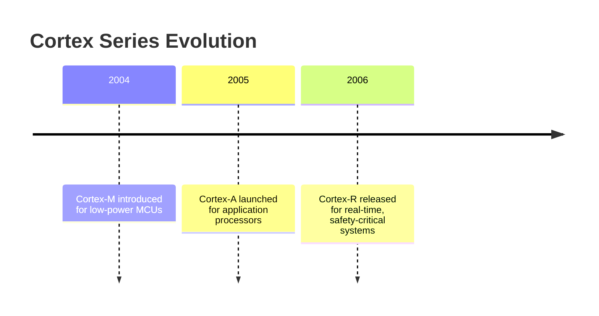
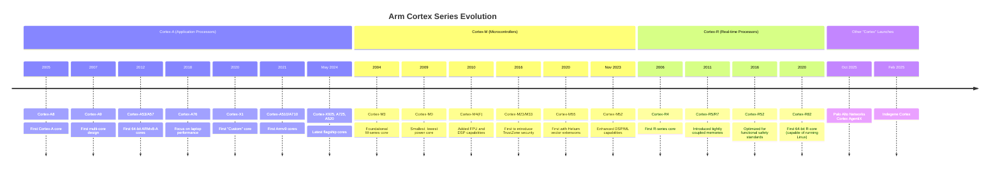

# 5. SoC Components & System Integration

System-on-Chip (SoC) designs integrate multiple processing cores, accelerators, and peripherals into a single silicon die, achieving a balance of performance, power efficiency, and flexibility. This chapter explores the key components and their integration.

## 5.1 Cortex Series
ARM’s Cortex lineup provides cores tailored to different application domains:

- **Cortex-M**: Microcontroller units (MCUs) optimized for low-power, real-time embedded tasks.  
- **Cortex-A**: High-performance application processors designed for OS-driven workloads.  
- **Cortex-R**: Real-time cores for safety-critical systems requiring deterministic performance.

ARM’s Cortex lineup provides cores tailored to different application domains:

| Series      | Target Use Case                      | Key Feature                          |
|------------|-------------------------------------|-------------------------------------|
| Cortex-M   | Microcontrollers (MCUs)             | Low-power, real-time tasks          |
| Cortex-A   | Application processors              | High-performance, OS-based workloads|
| Cortex-R   | Real-time systems                   | Deterministic performance for safety-critical apps |

### Timeline Diagram

## 5.2 DynamIQ & big.LITTLE
Modern SoCs leverage heterogeneous multi-core architectures:

- **big.LITTLE architecture**: Combines high-performance “big” cores with energy-efficient “LITTLE” cores to optimize power and performance.  
- **DynamIQ technology**: Provides flexible core clustering, enabling task migration and fine-grained performance scaling.

## 5.3 System IP Blocks
SoCs integrate specialized hardware blocks for specific tasks:

- **GPU (Mali)**: Accelerates graphics rendering.  
- **NPU**: Provides dedicated neural network and AI acceleration.  
- **ISP**: Handles image processing tasks for cameras and sensors.  
- **DMA**: Enables high-speed memory transfers without CPU intervention.  
- **Crypto engines**: Hardware acceleration for secure data operations (encryption/decryption).

## 5.4 Interconnect & Fabric
Efficient communication between cores and peripherals is achieved via AMBA interconnects:

- **AXI**: High-speed burst-based transactions for CPU/GPU/memory communication.  
- **AHB/APB**: Connects peripherals and low-bandwidth devices with a simple, power-efficient interface.  
- **CCI / CHI**: Cache coherent interconnects for multi-core scalability and consistency.

## 5.5 Boot Flow
SoCs follow a structured boot sequence to initialize hardware and software:

1. **ROM**: Executes minimal startup code.  
2. **Bootloader**: Initializes system components and loads the OS kernel.  
3. **Kernel**: Starts core operating system functionality.  
4. **Initramfs**: Temporary filesystem that launches services and mounts the final root filesystem.

This integration allows modern SoCs to deliver high performance while maintaining power efficiency, enabling everything from mobile devices to automotive and AI applications.
