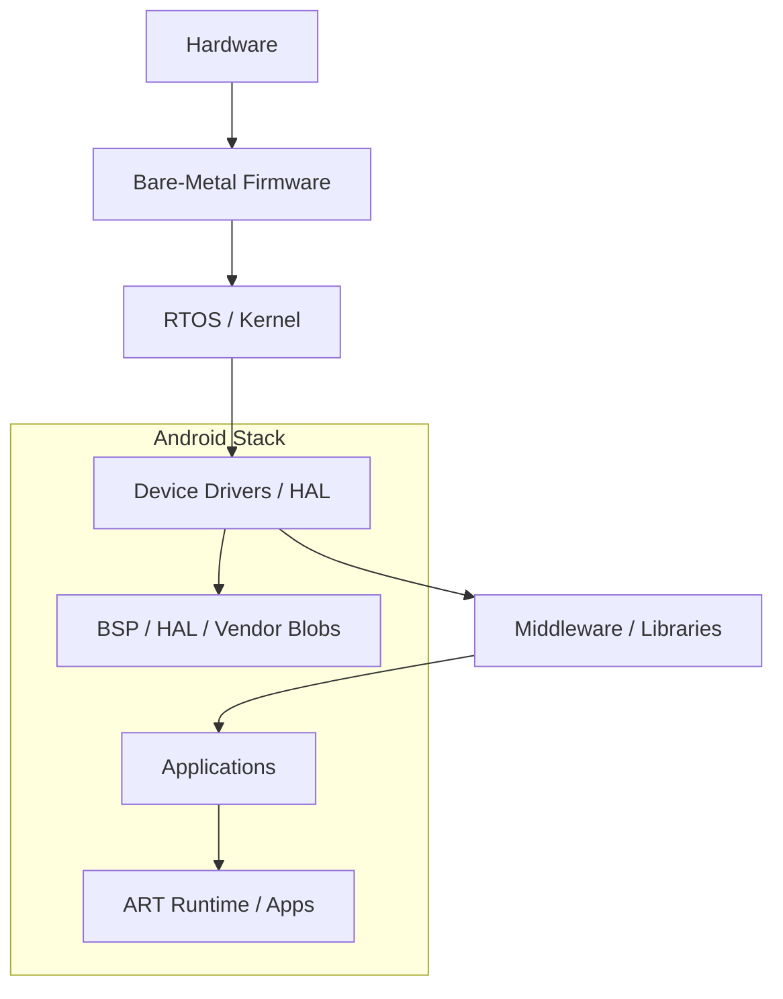

# 6. Operating Systems & Software Stack

ARM processors support a range of software environments, from full-featured OSes to bare-metal development.

## 6.1 Linux on ARM
- **Kernel**: Core OS functionality and device management.  
- **Device Tree**: Describes hardware to the kernel.  
- **Distributions**: Ubuntu, Debian, Yocto, etc.

## 6.2 Android Architecture
| Layer         | Description                                    |
|---------------|-----------------------------------------------|
| BSP           | Board Support Package for hardware initialization |
| HAL           | Hardware Abstraction Layer                     |
| ART Runtime   | Android Runtime for app execution             |
| Vendor Blobs  | Proprietary drivers and libraries             |

## 6.3 RTOS on ARM
| RTOS      | Features                                        |
|-----------|-----------------------------------------------|
| FreeRTOS  | Lightweight, preemptive scheduler             |
| Zephyr    | Scalable, modular embedded OS                  |
| RTEMS     | Real-time executive for safety-critical apps  |

## 6.4 Bare-Metal Development
- **Startup**: CPU initialization, stack setup.  
- **Interrupt Handling**: Vector tables and ISR routines.  
- **Memory Maps**: Direct register and peripheral access.

## 6.5 Toolchain & Compilers
- **GCC** and **LLVM/Clang**: Compile C/C++ for ARM.  
- **Optimization Flags**: ` -mcpu`, ` -march` for tuning code generation.

## 6.6 Debugging & Profiling
- **GDB**: Source-level debugging.  
- **perf**: Performance counters.  
- **ETM/ITM**: Trace modules for instruction and event monitoring.

### Software Stack Diagram

