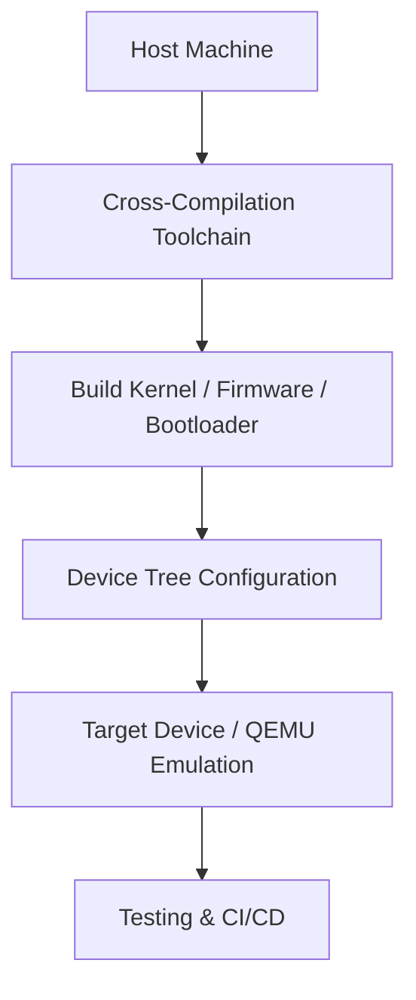

# 7. Development & Build Topics

ARM development requires understanding cross-compilation, device configuration, kernel building, and automated testing.

## 7.1 Cross-Compilation Basics
| Topic       | Description |
|------------|-------------|
| Toolchains | GCC, Clang/LLVM toolchains for target CPU architectures |
| Sysroots   | Directory trees containing headers and libraries for cross-compiling |
| QEMU       | Emulator for testing ARM binaries on a host machine |

## 7.2 Device Tree
- **Syntax**: Describes hardware in a hierarchical structure.  
- **Overlays**: Dynamically modify or extend device configurations.  
- **Bindings**: Define properties and behavior of devices.

## 7.3 Kernel Configuration
| Component           | Purpose |
|--------------------|---------|
| Kconfig             | Interactive configuration of kernel features |
| Architecture Drivers| CPU, SoC, and peripheral-specific drivers |

## 7.4 Firmware & Bootloaders
| Component | Role |
|-----------|------|
| UEFI      | Unified Extensible Firmware Interface for system initialization |
| U-Boot    | Popular bootloader for ARM boards |
| TF-A      | Trusted Firmware-A for secure boot and exception levels |

## 7.5 CI/CD & Testing
- **Hardware-in-loop**: Automates testing on actual ARM hardware.  
- **QEMU automation**: Simulates target environments for integration testing.

### Development Workflow Diagram

