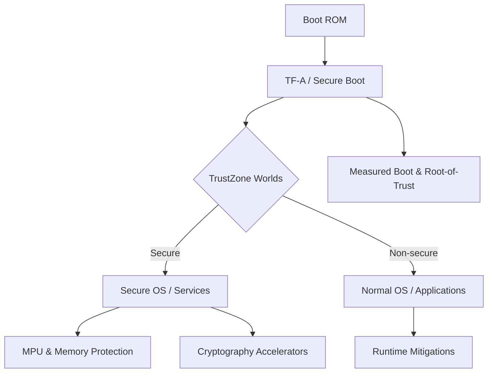

# 8. Security Features

ARM architectures provide multiple layers of security to protect systems from software and hardware attacks.

## 8.1 TrustZone
| Feature             | Description |
|-------------------|-------------|
| Secure vs Non-secure Worlds | Hardware-enforced separation of secure and normal execution environments |
| Secure Monitor     | Switches execution between secure and non-secure worlds |

## 8.2 Trusted Firmware-A (TF-A)
| Component       | Role |
|----------------|------|
| Secure Boot     | Verifies authenticity of bootloader and firmware |
| Firmware Model  | Provides standard APIs and runtime for secure services |

## 8.3 Memory Protection Unit (MPU)
- Provides memory region-based access control.  
- Commonly used in Cortex-M microcontrollers for isolating tasks.

## 8.4 Cryptography Accelerators
| Accelerator | Function |
|------------|---------|
| AES        | Hardware encryption/decryption |
| SHA        | Hardware hashing for integrity verification |

## 8.5 Runtime Mitigations
- Defends against speculative execution attacks like Spectre and Meltdown.  
- Includes branch predictor hardening and cache isolation.

## 8.6 Secure Boot & Measured Boot
| Term             | Purpose |
|-----------------|---------|
| Secure Boot      | Ensures only signed code executes at boot |
| Measured Boot    | Records hashes of each boot stage for attestation |
| Root-of-Trust    | Hardware-based cryptographic root for verification |
| Signature Chain  | Chain of trust from bootloader to OS |

### Security Features Diagram

