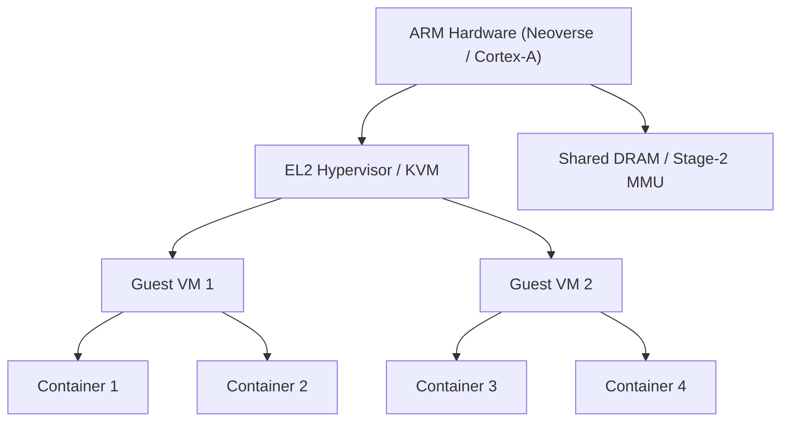
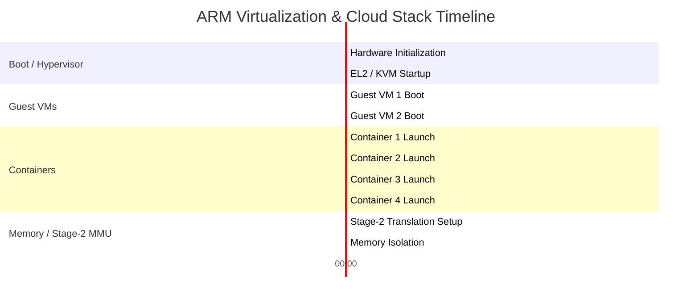
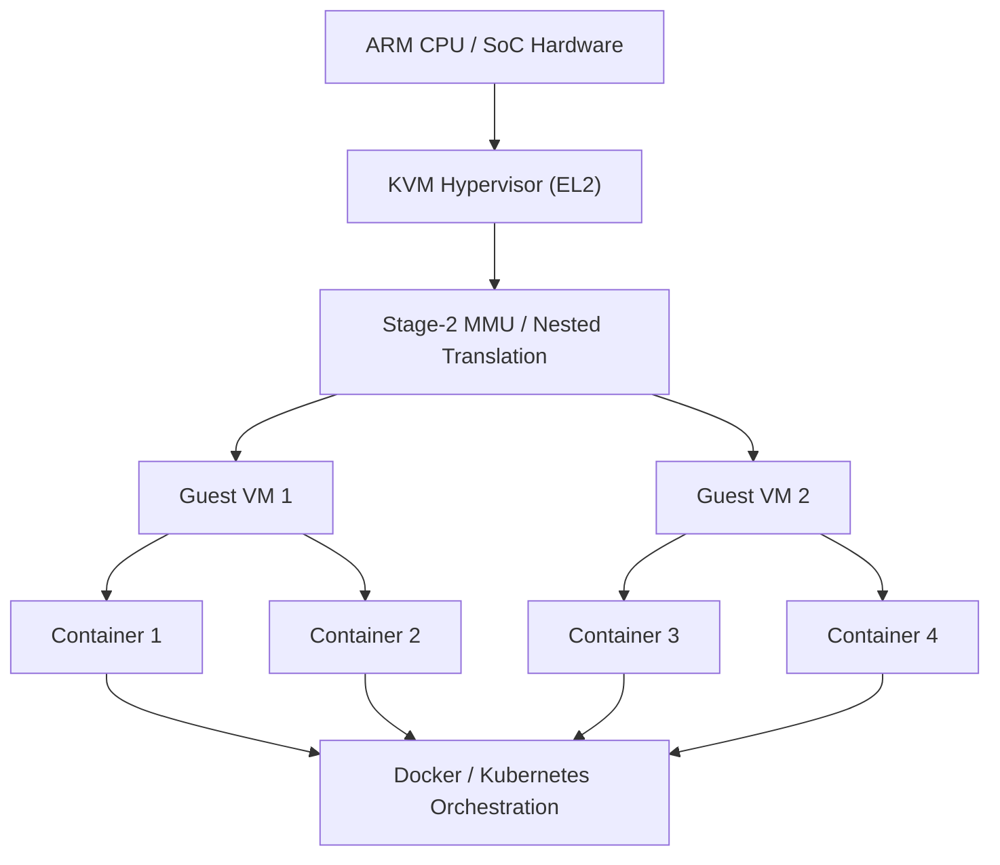

# 9. Virtualization & Cloud on ARM

ARM architecture provides advanced hardware support for virtualization, enabling efficient cloud deployments and high-performance server workloads. This chapter is focused on practical aspects for developers working with ARM-based virtualization and container orchestration.

---

## 9.1 Introduction

Virtualization allows multiple guest OS instances to run securely on the same physical ARM hardware. ARM supports this via **EL2 (Hypervisor mode)**, **Stage-2 MMU translation**, and hardware extensions found in server-class Neoverse cores. Containers and orchestration tools (like Docker and Kubernetes) can run on top of these virtualized environments to manage workloads efficiently.

---

## 9.2 KVM on ARM

| Feature                   | Description                                    | Developer Note                                 |
| ------------------------- | ---------------------------------------------- | ---------------------------------------------- |
| **EL2 Hypervisor Mode**   | Hardware execution level for hypervisors       | Use KVM to leverage EL2 for VM isolation       |
| **Traps & Emulation**     | Hypervisor traps privileged instructions from guests and emulates hardware | Needed to virtualize privileged instructions   |
| **Nested Virtualization** | Running VMs inside other VMs                   | Only supported on certain cores (Neoverse N2+) |
| **Guest Isolation**        | Enforces separation between virtual machines |

---

## 9.3 Stage-2 MMU

| Feature                   | Description                                              | Benefit                               |
| ------------------------- | -------------------------------------------------------- | ------------------------------------- |
| **Nested Translation**    | Guest virtual addresses → guest physical → host physical. Provides second-level address translation for guests | Full isolation of guest memory        |
| **Hardware Enforcement**  | Memory access violations trap to hypervisor. Ensures virtual machines cannot access each other’s memory              | Improves security and debugging       |
| **Shared Memory Support** | Allows communication between guests and host             | Useful for high-performance workloads |

## 9.4 ARM Neoverse for Cloud & HPC

| Platform                    | Use Case                   | Key Features                                             |
| --------------------------- | -------------------------- | -------------------------------------------------------- |
| **Neoverse N1/N2**          | General cloud, web servers | High core counts, scalable cache, virtualization support |
| **Neoverse V1**             | HPC / AI                   | Wide SIMD units, SVE, memory bandwidth optimized         |
| **Ampere Altra / Graviton** | Public cloud servers       | Energy-efficient, optimized for containers & VMs         |

| Platform               | Purpose |
|-----------------------|---------|
| Datacenter / HPC       | Server-class cores optimized for throughput and efficiency |
| Scalable Designs       | Large-core count clusters for cloud and HPC workloads |
---

## 9.5 Containers & Orchestration

* **Docker**: Runs containerized workloads on ARM VMs or bare-metal.
* **Kubernetes**: Orchestrates multiple nodes and scales workloads.
* Containers can run **directly on virtualized guests** or on bare-metal ARM servers.

---

## 9.6 Developer Diagram: ARM Virtualization Stack

 ARM virtualization stack with hypervisor, guest VMs, and containers. Stage-2 MMU ensures memory isolation between guests.

---

## 9.7 Developer Tips

1. Enable **KVM** in the kernel config for ARM (`CONFIG_KVM_ARM_VIRTUALIZATION`).
2. Use **QEMU** for testing guest images locally before deployment.
3. For high-performance VMs, choose **Neoverse N2/V1 cores** to exploit hardware virtualization and cache hierarchies.
4. Leverage **nested Stage-2 page tables** for secure, isolated multi-tenant workloads.
5. Combine **containers with lightweight VMs** for cloud-native applications, improving both density and security.

---

> **Note:** Always verify hardware features on your ARM board using `lscpu` or `dmesg` to ensure EL2, Stage-2 MMU, and virtualization extensions are enabled.

**Figure 9.2:** Timeline of ARM virtualization, showing hardware boot, hypervisor startup, guest VMs, container launches, and Stage-2 memory isolation.

**Figure 9.3:** ARM virtualization stack from hardware through hypervisor, guest VMs, containers, and orchestration.
This helps developers visualize how VMs and containers map onto the underlying ARM hardware and memory system.

| Feature / Layer       | Tools / Technology                  | Developer Considerations                                            |
| --------------------- | ----------------------------------- | ------------------------------------------------------------------- |
| **Hardware**          | ARM Neoverse, Cortex-A server cores | Understand cache hierarchies, NUMA, memory bandwidth for VMs        |
| **Hypervisor**        | KVM on ARM, QEMU                    | EL2 traps, stage-2 MMU configuration, virtualization extensions     |
| **Memory Management** | Stage-2 MMU, Nested Page Tables     | Guest isolation, memory translation overhead, TLB management        |
| **Guest VMs**         | Linux, Windows, RTOS on ARM         | Kernel configuration for virtualization, device passthrough         |
| **Containers**        | Docker, Podman                      | Resource limits, cgroups, namespaces, performance tuning            |
| **Orchestration**     | Kubernetes                          | Node labeling, ARM node compatibility, cloud-native CI/CD pipelines |
| **Security**          | SELinux, Secure Boot, TF-A          | Ensure secure VM/Container startup, enforce root-of-trust           |
| **Performance Tools** | perf, ftrace, ETM/ITM               | Profiling hypervisor, guest OS, and container workloads             |

**Tip for developers:** Focus on how hardware virtualization features map to the hypervisor, and how guest OS and container workloads interact with stage-2 MMU and caches for optimized performance.

