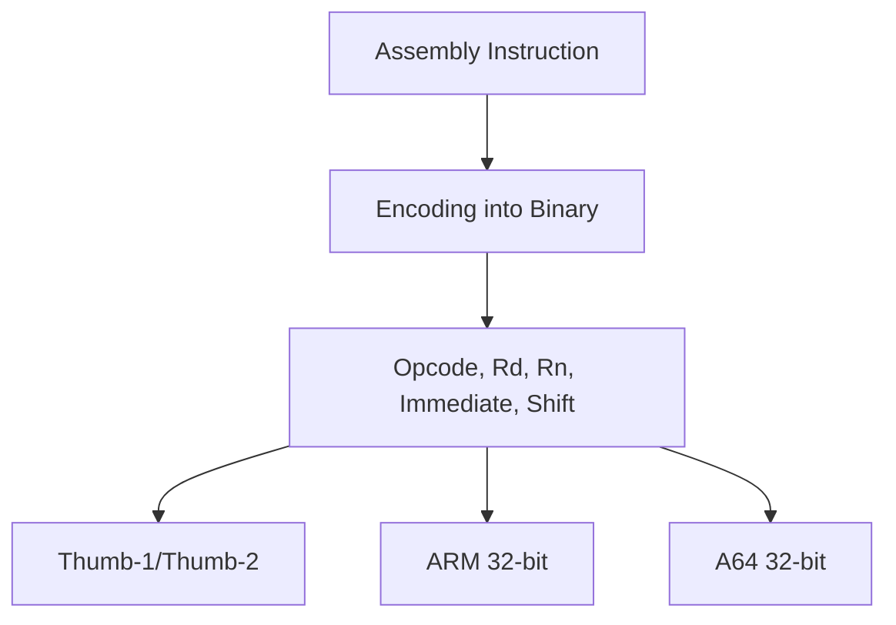

# 10. Instruction Encodings

Instruction encoding defines how assembly instructions are represented as binary machine code. Understanding ARM encodings is crucial for low-level optimization, debugging, and writing inline assembly.

---

## 10.1 ARM vs Thumb vs A64

| Encoding    | Description                                       | Instruction Size | Use Case                              |
| ----------- | ------------------------------------------------- | ---------------- | ------------------------------------- |
| **ARM**     | Original 32-bit fixed-length encoding             | 32-bit           | Legacy and high-performance code      |
| **Thumb-1** | 16-bit compressed instructions                    | 16-bit           | Code size reduction, embedded systems |
| **Thumb-2** | Mixed 16/32-bit instructions, backward-compatible | 16/32-bit        | Efficient code size with performance  |
| **A64**     | ARMv8 64-bit encoding                             | 32-bit           | AArch64 execution state, modern apps  |

---

## 10.2 Instruction Format

ARM instructions include fields such as:

* **Opcode:** Operation to perform (ADD, SUB, MOV, etc.)
* **Rd, Rn, Rm:** Destination and source registers
* **Immediate values:** Constant literals embedded in instruction
* **Condition codes:** Optional (for conditional execution in ARM/Thumb)
* **Shift / rotate fields:** For operand manipulation

**Example: ADD instruction in Thumb-2**

```asm
ADD R0, R1, #5   ; R0 = R1 + 5
```

Encoding breakdown (simplified):

| Field              | Value  |
| ------------------ | ------ |
| Opcode             | ADD    |
| Rd                 | R0     |
| Rn                 | R1     |
| Immediate          | 5      |
| Instruction Length | 32-bit |

---

## 10.3 ARM Assembler Directives

Directives provide guidance to the assembler without generating actual instructions.

| Directive | Description                          |
| --------- | ------------------------------------ |
| `.text`   | Start of code section                |
| `.data`   | Start of data section                |
| `.align`  | Align next data/instruction boundary |
| `.word`   | Define 32-bit constant               |
| `.byte`   | Define 8-bit constant                |
| `.global` | Export symbol to linker              |

**Example: Using directives**

```asm
    .text
    .global _start
_start:
    MOV R0, #1
    BX LR
```

---

## 10.4 Encoding Flow Diagram



---

## 10.5 Summary

Instruction encoding is key to bridging human-readable assembly and binary machine code. Mastery of Thumb, ARM, and A64 encodings allows developers to optimize performance, manage code size, and work effectively with low-level ARM features.
