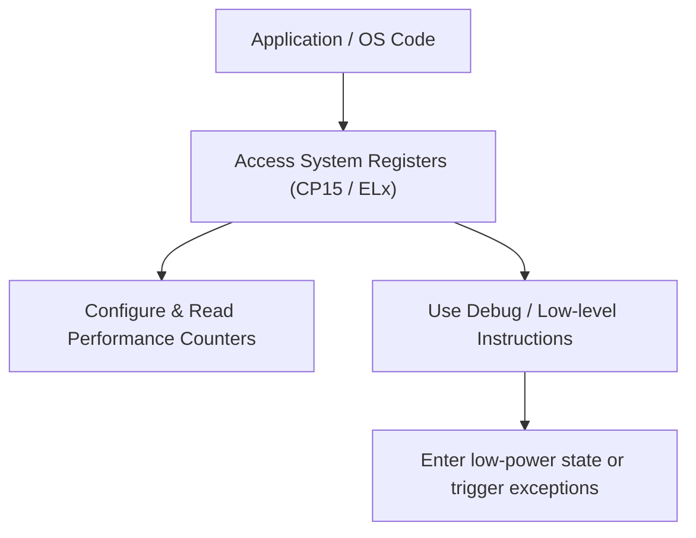

# 11. System Programming

System programming in ARM involves controlling and monitoring the processor through system registers, performance counters, and specialized instructions. This is essential for OS developers, firmware engineers, and low-level debugging.

---

## 11.1 System Registers (CP15 / System Registers)

System registers provide control over processor modes, memory management, cache, and exceptions.

| Register                 | Purpose                                                                  |
| ------------------------ | ------------------------------------------------------------------------ |
| **CP15**                 | ARMv7 system control coprocessor for MMU, cache, TLB, and more           |
| **SCTLR**                | System Control Register: Enables/disables caches, MMU, branch prediction |
| **TTBR0/TTBR1**          | Translation Table Base Registers for MMU                                 |
| **DACR**                 | Domain Access Control Register: Access permissions for memory domains    |
| **ELx System Registers** | ARMv8 EL0–EL3 specific control (SPSR_ELx, SCR_EL3, etc.)                 |

**Example: Enabling MMU (simplified, ARMv7)**

```asm
MRC p15, 0, r0, c1, c0, 0   ; Read SCTLR
ORR r0, r0, #1              ; Set M bit to enable MMU
MCR p15, 0, r0, c1, c0, 0   ; Write back SCTLR
```

---

## 11.2 Performance Counters and PMU

ARM Performance Monitoring Unit (PMU) tracks events like instructions executed, cache hits/misses, and branch mispredictions.

| Feature                        | Description                            |
| ------------------------------ | -------------------------------------- |
| **Cycle Counter (PMCCNTR)**    | Counts CPU cycles                      |
| **Event Counters (PMXEVCNTR)** | Counts specific events (cache, branch) |
| **Overflow interrupt**         | Can trigger interrupt on threshold     |

**Example: Reading cycle counter**

```asm
MRC p15, 0, r0, c9, c13, 0  ; Read PMCCNTR
```

---

## 11.3 Low-Level Debugging Instructions

ARM provides instructions to control execution for debugging and power management.

| Instruction | Purpose                                              |
| ----------- | ---------------------------------------------------- |
| **BRK**     | Breakpoint instruction for debug exception (AArch64) |
| **HVC**     | Hypervisor call (trap to EL2)                        |
| **WFI**     | Wait For Interrupt — low-power state until interrupt |
| **WFE**     | Wait For Event — low-power state until event occurs  |

**Example: Using WFI**

```asm
WFI   ; Processor enters low-power sleep until next interrupt
```

---

## 11.4 System Programming Flow Diagram



---

## 11.5 Summary

System programming enables developers to manage processor state, optimize performance, and handle low-level debugging. Key areas include:

* Accessing system registers for control and configuration.
* Utilizing performance counters to profile workloads.
* Leveraging specialized instructions (BRK, HVC, WFI/WFE) for debugging and power management.

Understanding these mechanisms is critical for embedded firmware, kernel development, and ARM-based system optimization.
