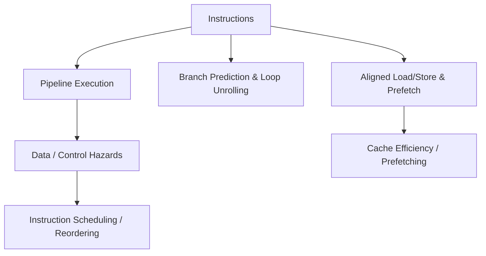

# 12. Optimization Guidelines

Optimizing ARM-based software involves understanding the processor pipeline, branch behavior, memory access patterns, and instruction scheduling. Proper optimization improves performance, reduces power consumption, and prevents pipeline stalls.

---

## 12.1 Pipeline Considerations

ARM cores use pipelining to execute multiple instructions in overlapping stages (fetch, decode, execute, memory, writeback). Understanding pipeline behavior helps avoid hazards:

| Concept                    | Description                                                                                                                                  |
| -------------------------- | -------------------------------------------------------------------------------------------------------------------------------------------- |
| **Pipeline Depth**         | Number of stages in the processor pipeline. Deeper pipelines increase instruction throughput but are more sensitive to branch misprediction. |
| **Data Hazards**           | Occur when instructions depend on results of previous instructions. Can cause stalls.                                                        |
| **Instruction Scheduling** | Reordering instructions to avoid stalls and maximize parallel execution.                                                                     |

**Example:** Avoid back-to-back dependent instructions:

```asm
LDR r0, [r1]
ADD r2, r0, r3   ; Use r0 immediately after load may stall
```

Better scheduling:

```asm
LDR r0, [r1]
NOP              ; or independent instruction
ADD r2, r0, r3
```

---

## 12.2 Branch Prediction and Loop Unrolling

### Branch Prediction

ARM cores use dynamic branch prediction to reduce pipeline flushes. Predictable branches (like loops) execute faster.

| Technique                         | Benefit                              |
| --------------------------------- | ------------------------------------ |
| **Branch Hinting**                | Hint likely branch path for compiler |
| **Avoiding Unnecessary Branches** | Reduces misprediction penalties      |

### Loop Unrolling

Reduces branch overhead by repeating loop body multiple times per iteration.

**Example:**

```c
// Normal loop
for(int i=0; i<8; i++) { sum += arr[i]; }

// Unrolled loop
sum += arr[0]; sum += arr[1];
sum += arr[2]; sum += arr[3];
sum += arr[4]; sum += arr[5];
sum += arr[6]; sum += arr[7];
```

Unrolling reduces conditional branches and increases instruction-level parallelism.

---

## 12.3 Load/Store and Memory Alignment

Memory access is faster when aligned to natural boundaries (4-byte for words, 8-byte for double words). Misaligned accesses can cause extra cycles or faults on strict architectures.

| Concept                  | Guideline                                               |
| ------------------------ | ------------------------------------------------------- |
| **Aligned Access**       | Ensure LDR/STR use addresses divisible by data size.    |
| **Cache Line Awareness** | Access contiguous memory to reduce cache misses.        |
| **Prefetching**          | Use `PLD` or software prefetch to load data before use. |

**Example:** Proper alignment for word access:

```c
uint32_t *ptr = (uint32_t *)0x20000000;  // Aligned to 4 bytes
uint32_t val = *ptr;                     // Efficient access
```

---

## 12.4 Summary

Optimizing ARM software involves:

* Understanding the pipeline and minimizing hazards.
* Leveraging branch prediction and loop unrolling to reduce stalls.
* Ensuring aligned load/store operations and efficient memory access.

These techniques help developers maximize performance, reduce latency, and improve power efficiency on ARM platforms.

---


