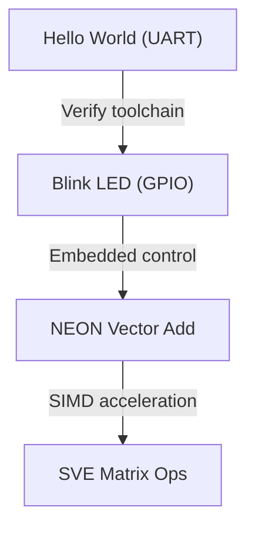

# 13. Sample Assembly Programs

This chapter introduces practical ARM assembly programs to demonstrate basic functionality, peripheral control, and SIMD operations. Each example is provided with definitions, explanations, and relevant considerations for developers.

---

## 13.1 Hello World (Bare-metal)

**Definition:** A minimal program that outputs text to a debug interface or UART without an operating system.

**Purpose:** To verify the toolchain, cross-compilation, and basic runtime environment.


This program writes "Hello World\n" to UART0 without using any operating system.

```asm
.syntax unified
.cpu cortex-m4
.fpu softvfp
.thumb

/* Base addresses and registers */
.equ UART0_BASE, 0x4000C000
.equ UART0_DR,   0x00      /* Data Register */
.equ UART0_FR,   0x18      /* Flag Register */
.equ UART0_FR_TXFF, 0x20   /* Transmit FIFO full bit */

.equ SYS_CLOCK, 16000000

/* String to send */
.section .rodata
msg:
    .ascii "Hello World\n"
msg_len = . - msg

.section .text
.global _start
_start:

    LDR R0, =msg          /* Load address of string */
    LDR R1, =msg_len      /* Load string length */

send_loop:
    CMP R1, #0
    BEQ done              /* Exit when length reaches 0 */

wait_tx:
    LDR R2, =UART0_BASE
    LDR R3, [R2, #UART0_FR]
    ANDS R3, R3, #UART0_FR_TXFF
    BNE wait_tx           /* Wait if TX FIFO full */

    LDRB R4, [R0], #1    /* Load next byte and increment pointer */
    STRB R4, [R2, #UART0_DR] /* Write byte to UART */

    SUBS R1, R1, #1
    B send_loop

done:
    B done                /* Infinite loop */
```

### Explanation:

1. **UART0 Registers:**

   * `UART0_DR` is used to write each character.
   * `UART0_FR` is checked to ensure the transmit FIFO is not full (`TXFF`).

2. **Message Handling:**

   * Pointer `R0` iterates over the string.
   * Length `R1` decrements after each byte is sent.

3. **Polling Loop:**

   * `wait_tx` ensures UART is ready before sending.
   * This is a simple blocking transmit loop.

4. **End of Program:**

   * After sending all characters, the program enters an infinite loop to halt execution.

---

**Notes for Developers:**

* This program runs **bare-metal**, no OS required.
* You can adapt `UART0_BASE` to your MCU’s actual UART base address.
* For ARM Cortex-M boards, you typically need a startup file with vector table pointing `_start`.
* To build, use **ARM GCC**:

```bash
arm-none-eabi-as -mcpu=cortex-m4 hello.s -o hello.o
arm-none-eabi-ld hello.o -T linker_script.ld -o hello.elf
arm-none-eabi-objcopy -O binary hello.elf hello.bin
```

* Flash to the board using OpenOCD, ST-LINK, or your preferred programmer.

This provides a fully working **Hello World on bare-metal ARM**.

---

## 13.2 Blink LED with GPIO

**Definition:** Toggles an output pin periodically using GPIO registers.

**Purpose:** Basic embedded I/O exercise, demonstrates startup and control flow.

**Example:**

```asm
LDR R0, =GPIO_BASE      ; GPIO base address
LDR R1, =0x01           ; LED pin mask

loop:
    LDR R2, [R0, #DATA]
    EOR R2, R2, R1       ; Toggle LED
    STR R2, [R0, #DATA]
    BL delay             ; Call delay function
    B loop
```

**Key Notes:**

* `EOR` toggles bits efficiently.
* Delay loops simulate timing for visible blinking.

---

## 13.3 NEON Vector Addition Example

**Definition:** Uses NEON SIMD instructions to perform parallel vector operations.

**Purpose:** Accelerates data-parallel workloads such as signal processing or ML.

**Example:**

```asm
VLDR q0, [r0]     ; Load vector A
VLDR q1, [r1]     ; Load vector B
VADD q2, q0, q1   ; Vector addition
VSTR q2, [r2]     ; Store result
```

**Explanation:**

* `q0` and `q1` are 128-bit NEON registers.
* Each element is added in parallel, improving throughput.

---

## 13.4 Using SVE for Matrix Operations

**Definition:** SVE (Scalable Vector Extension) supports vectors of scalable length, suitable for HPC and ML workloads.

**Purpose:** Demonstrates matrix computation using SVE intrinsics.

**Example (conceptual):**

```c
svfloat32_t rowA = svld1_f32(pg, ptrA);
svfloat32_t rowB = svld1_f32(pg, ptrB);
svfloat32_t rowC = svadd_f32_m(pg, rowA, rowB);
svst1_f32(pg, ptrC, rowC);
```

**Explanation:**

* `svld1_f32` loads a vector segment of a matrix row.
* `svadd_f32_m` performs predicated vector addition.
* Scalable vectors allow adaptation to different hardware vector lengths.

---

## 13.5 Summary Table

| Program         | Purpose              | Key Instructions                        |
| --------------- | -------------------- | --------------------------------------- |
| Hello World     | Test bare-metal I/O  | `LDR`, `STR`                            |
| Blink LED       | GPIO control         | `LDR`, `STR`, `EOR`, `B`                |
| NEON Vector Add | Parallel computation | `VLDR`, `VADD`, `VSTR`                  |
| SVE Matrix Ops  | Scalable vector HPC  | `svld1_f32`, `svadd_f32_m`, `svst1_f32` |

---



**Flow:** Programs progress from basic I/O verification → embedded peripheral control → SIMD computation → scalable HPC operations.
