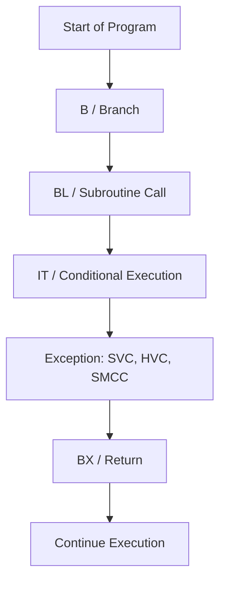
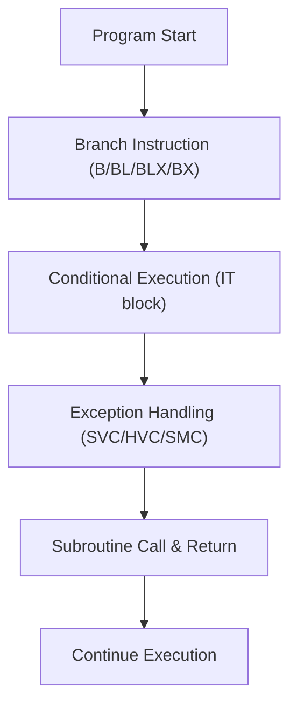

# 5. Branch and Control Instructions

Branch and control instructions manage the flow of execution in ARM programs. They include jumps, subroutine calls, conditional execution, and exception handling.

## 5.1 Branch Instructions
* **Purpose:** Change the program counter (PC) to a new address.
* **Flow:**

  1. Evaluate branch target (label or register).
  2. Update PC to target address.
  3. If using `BL`, store return address in LR for subroutine return.

| Instruction | Description                                                   | Example                                |
| ----------- | ------------------------------------------------------------- | -------------------------------------- |
| **B**       | Branch to a label                                             | `B loop_start`                         |
| **BL**      | Branch with link (subroutine call)                            | `BL func` ; saves return address in LR |
| **BLX**     | Branch with link and exchange instruction set (ARM/Thumb)     | `BLX R3`                               |
| **BX**      | Branch to register address, optionally switch instruction set | `BX LR` ; return from function         |

**Notes:**

* `BL` saves the return address in the link register (LR).
* `BLX` allows switching between ARM and Thumb modes.

## 5.2 Conditional Execution

* **Purpose:** Execute instructions only if specific condition flags are set, reducing unnecessary branches and pipeline stalls.
* **Flow:**

  1. Check condition flags in CPSR (N, Z, C, V).
  2. If condition is true, execute instruction(s) in IT block.
  3. If false, skip instruction(s) seamlessly.

ARM supports conditional execution to avoid branch overhead. In Thumb-2, **IT (If-Then) blocks** allow conditional execution of up to 4 instructions.

| Feature      | Description                                  | Example                                           |
| ------------ | -------------------------------------------- | ------------------------------------------------- |
| **IT Block** | Conditionally executes next 1-4 instructions | `ITTE EQ`   `MOVEQ R0, #0`   `MOVEQ R1, #1` |

**Notes:**

* Reduces branching and improves pipeline efficiency.
* Conditions are based on flags in the CPSR.

## 5.3 Exception Handling

* **Purpose:** Safely handle software or hardware events requiring privileged execution.
* **Flow:**

  1. Trigger exception using `SVC`, `HVC`, or `SMC`.
  2. Save current context (PC, CPSR).
  3. Jump to exception vector in vector table.
  4. Execute handler in privileged mode.
  5. Return to original execution point using `BX LR` or `ERET`.

Exceptions are triggered by software or hardware events:

| Instruction | Description                          |
| ----------- | ------------------------------------ |
| **SVC**     | Supervisor Call (software interrupt) |
| **HVC**     | Hypervisor Call                      |
| **SMC**     | Secure Monitor Call (TrustZone)      |

**Notes:**

* Used to switch from user to privileged mode.
* Exception vectors are handled via vector tables.

## 5.4 Return and Subroutine Conventions

* **Purpose:** Restore control after function/subroutine execution.
* **Flow:**

  1. Complete subroutine tasks.
  2. Retrieve return address from LR.
  3. Use `BX LR` to return to caller.
  4. Optionally restore callee-saved registers.

* Functions return using `BX LR`.
* Link Register (LR) holds the return address.
* Caller-saved and callee-saved register conventions apply.

## 5.5 Mermaid Diagram

**Summary of Flow:**

* **Branch instructions** determine program control flow and subroutine calls.
* **Conditional execution** allows selective instruction execution without branching penalties.
* **Exceptions** safely transition execution to privileged modes for handling interrupts or system calls.
* **Return instructions** ensure correct restoration of execution state after subroutine completion.
