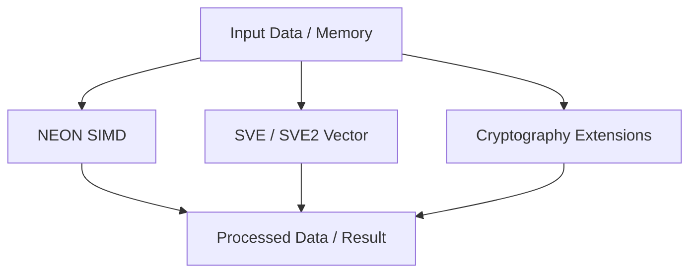

# 6. SIMD & Advanced Instructions

ARM provides a set of advanced instructions to accelerate compute-intensive workloads like multimedia, AI/ML, and cryptography. These include NEON, SVE/SVE2, and cryptography extensions.

---

## 6.1 NEON Instructions

**Definition:**
NEON is ARM's SIMD (Single Instruction Multiple Data) extension for performing parallel operations on vectors of data.

**Key Features:**

* Vector operations on 64-bit or 128-bit registers.
* Supports arithmetic, logical, shift, and multiply-accumulate instructions.
* Accelerates multimedia, DSP, and ML workloads.

**Example:** Vector addition using NEON intrinsics in C:

```c
#include <arm_neon.h>

int main() {
    int32x4_t a = {1, 2, 3, 4};
    int32x4_t b = {5, 6, 7, 8};
    int32x4_t c = vaddq_s32(a, b); // c = a + b
    return 0;
}
```

| Instruction | Operation               | Description                        |
| ----------- | ----------------------- | ---------------------------------- |
| `vadd`      | Vector addition         | Adds elements of two vectors       |
| `vsub`      | Vector subtraction      | Subtracts elements of two vectors  |
| `vmul`      | Vector multiplication   | Multiplies elements of two vectors |
| `vld1`      | Load vector from memory | Loads data into NEON registers     |
| `vst1`      | Store vector to memory  | Writes NEON register to memory     |

---

## 6.2 SVE / SVE2

**Definition:**
SVE (Scalable Vector Extension) is ARM’s next-generation SIMD architecture, scalable from 128-bit up to 2048-bit vectors. SVE2 extends SVE with additional DSP, cryptography, and ML-friendly instructions.

**Key Features:**

* Vector length agnostic (VLA) for scalable workloads.
* Predication support for conditional vector operations.
* Accelerates HPC, AI, and signal processing.

| Feature      | SVE           | SVE2                  |
| ------------ | ------------- | --------------------- |
| Vector width | 128–2048 bits | 128–2048 bits         |
| Predication  | Yes           | Yes                   |
| DSP support  | Limited       | Extended (MAC, shift) |
| Cryptography | Optional      | Extended              |
| ML / HPC     | Yes           | Optimized             |

---

## 6.3 Cryptography Extensions

**Definition:**
ARM cryptography extensions accelerate common cryptographic algorithms such as AES, SHA, and polynomial multiplication (PMULL) using hardware instructions.

**Examples:**

* `AESD` / `AESE`: AES decryption/encryption rounds
* `SHA1C` / `SHA256H` : SHA hash computations
* `PMULL` : Polynomial multiplication for Galois field operations

| Instruction | Algorithm    | Use Case                               |
| ----------- | ------------ | -------------------------------------- |
| `AESD`      | AES Decrypt  | Block cipher decryption                |
| `AESE`      | AES Encrypt  | Block cipher encryption                |
| `SHA1C`     | SHA-1 Hash   | Message digest calculation             |
| `SHA256H`   | SHA-256 Hash | Message digest calculation             |
| `PMULL`     | GF(2^128)    | Galois field multiplication for crypto |

---

## 6.4 Conceptual Flow Diagram



**Summary:**

* **NEON**: Optimized SIMD for multimedia and ML on 64/128-bit vectors.
* **SVE / SVE2**: Scalable vectors for HPC, AI, and DSP workloads.
* **Cryptography extensions**: Hardware acceleration for AES, SHA, and PMULL operations.

These advanced instructions enable ARM processors to deliver high performance for compute-heavy applications while keeping energy efficiency high.
