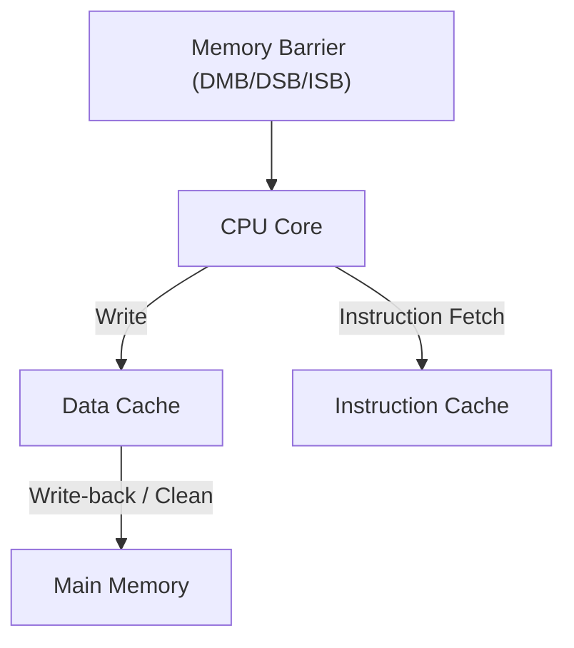

# 7. Memory Model and Barriers

ARM architectures implement a **relaxed memory model** designed for high performance on multicore systems. Understanding memory ordering, barriers, and cache maintenance is essential for correct and efficient system programming.

---

## 7.1 Memory Ordering Rules

**Definition:**
Memory ordering determines the sequence in which read and write operations appear to execute on different cores.

* **Strongly Ordered:** Operations appear in program order to all observers (rare in ARM).
* **Weakly Ordered:** Loads and stores may be executed out-of-order for performance, making explicit barriers necessary.

| Ordering Type | Description                                       | Use Case                    |
| ------------- | ------------------------------------------------- | --------------------------- |
| Strong        | All memory accesses are globally visible in order | Legacy or critical systems  |
| Weak          | Memory accesses can be reordered                  | Multicore, high-performance |

**Example:**
Without a memory barrier, CPU may reorder writes to two shared variables:

```c
var1 = 1;
var2 = 2; // CPU may write var2 before var1 on another core
```

---

## 7.2 Memory Barriers

**Definition:**
Memory barriers enforce ordering constraints, ensuring correct execution of multithreaded code.

| Barrier                                       | Purpose                                                                                                                             |
| --------------------------------------------- | ----------------------------------------------------------------------------------------------------------------------------------- |
| **DMB** (Data Memory Barrier)                 | Ensures all explicit memory accesses before the barrier complete before any after it                                                |
| **DSB** (Data Synchronization Barrier)        | Ensures all explicit memory accesses and their effects complete before continuing                                                   |
| **ISB** (Instruction Synchronization Barrier) | Flushes the pipeline, ensuring subsequent instructions execute with updated context (e.g., after changing system control registers) |

**Example: Ensuring Proper Store Ordering**

```c
var1 = 1;
__asm__ volatile("dmb ish");  // DMB ensures var1 is visible before var2
var2 = 2;
```

---

## 7.3 Cache Maintenance Instructions

**Definition:**
Cache maintenance instructions control cache behavior to ensure memory coherency, especially in shared-memory and DMA systems.

| Instruction | Description                                           | Use Case                          |
| ----------- | ----------------------------------------------------- | --------------------------------- |
| `DC CIVAC`  | Clean & invalidate data cache line by virtual address | DMA buffer flush                  |
| `DC CVAC`   | Clean data cache line to PoC                          | Write-back before sharing         |
| `DC IVAC`   | Invalidate data cache line                            | Avoid stale reads                 |
| `IC IALLU`  | Invalidate instruction cache                          | After code modification in memory |

**Example: Clean cache for DMA buffer**

```c
#define DMA_BUFFER_ADDR 0x80000000
#define DMA_BUFFER_SIZE 1024

for (int i = 0; i < DMA_BUFFER_SIZE; i+=64) {
    __asm__ volatile("dc civac, %0" : : "r" (DMA_BUFFER_ADDR + i));
}
__asm__ volatile("dsb ish");  // Ensure all cache operations complete
```

---

## 7.4 Conceptual Flow Diagram



**Summary:**

* ARM’s **weak memory ordering** improves performance but requires careful use of **DMB, DSB, ISB** barriers.
* **Cache maintenance instructions** ensure coherency between CPU, memory, and peripherals.
* Developers must combine barriers and cache operations when working with shared memory, DMA, or multicore synchronization.

This chapter equips developers with the knowledge to correctly synchronize memory and manage cache behavior on ARM platforms.
