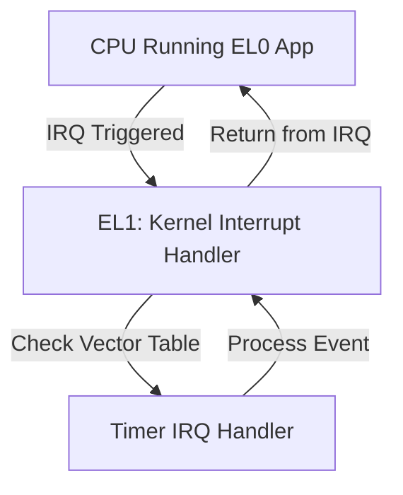
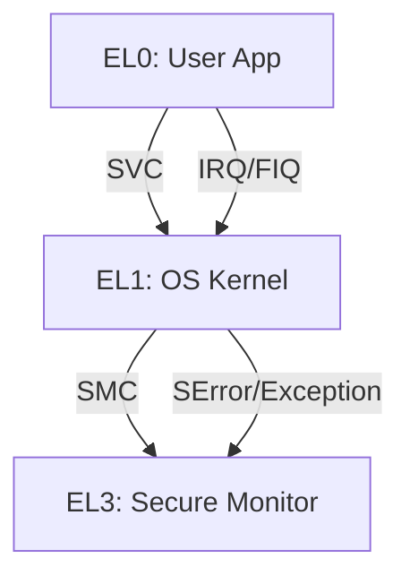

# 8. Exception Levels & Privilege

ARMv8-A architecture introduces **exception levels (ELs)** and privilege separation to manage system security, access control, and interrupt handling. Understanding these concepts is crucial for developing operating systems, secure applications, and low-level firmware.

---

## 8.1 Exception Levels (EL0–EL3)

**Definition:**
Exception Levels (ELs) define CPU privilege and execution rights. Each higher EL has more privileges and can access resources of lower ELs.

| Exception Level | Privilege      | Typical Use Case                           |
| --------------- | -------------- | ------------------------------------------ |
| **EL0**         | Unprivileged   | User-space applications                    |
| **EL1**         | Privileged     | Operating system kernel                    |
| **EL2**         | Hypervisor     | Virtualization / hypervisor control        |
| **EL3**         | Secure Monitor | Trusted firmware, TrustZone secure monitor |

**Notes:**

* EL0 cannot directly access system registers or privileged instructions.
* Transitions between ELs occur via **exceptions, SVC calls, or secure monitor calls (SMC)**.

---

## 8.2 Secure vs Non-Secure States (TrustZone)

**Definition:**
ARM TrustZone provides hardware-enforced separation between **Secure** and **Non-Secure** worlds. Each EL can operate in either state:

| State      | Description                          | Use Case                  |
| ---------- | ------------------------------------ | ------------------------- |
| Secure     | Full access, protected resources     | Cryptography, secure boot |
| Non-Secure | Limited access, normal OS operations | General applications      |

**Secure Monitor (EL3)** manages context switching between Secure and Non-Secure states.

**Example Flow:**


---

## 8.3 Interrupt Handling and Vector Tables

**Definition:**
ARM exception model defines vectors for handling interrupts and synchronous exceptions. Vector tables map exception types to handler routines.

| Exception Type        | EL Target | Example Handlers                      |
| --------------------- | --------- | ------------------------------------- |
| Synchronous Exception | EL1/EL3   | Illegal instruction, system call      |
| IRQ                   | EL1       | Timer interrupt, peripheral interrupt |
| FIQ                   | EL1       | High-priority fast interrupts         |
| SError                | EL1/EL3   | System error                          |

**Vector Table Structure (ARMv8-A):**

```text
+---------------------+
| Reset Handler       |
+---------------------+
| IRQ Handler         |
+---------------------+
| FIQ Handler         |
+---------------------+
| SError Handler      |
+---------------------+
| Synchronous Handler |
+---------------------+
```

**Notes:**

* Vector table address is defined in **VBAR_ELx** register for each exception level.
* Secure and Non-Secure states have separate vector tables.

**Interrupt Handling Flow (Example: Timer Interrupt)**



**Steps:**

1. Peripheral asserts an IRQ signal.
2. CPU traps to **EL1** (kernel) via vector table.
3. Handler executes: acknowledges interrupt, services device.
4. Execution returns to EL0 user app.

**Notes:**

* **FIQ** is for fast, high-priority interrupts.
* **SError** handles unrecoverable errors like memory faults.
* Proper setup of **VBAR_ELx** is critical to avoid undefined behavior.
* Nested interrupts require careful **priority management**.


---

## 8.4 Conceptual Flow Diagram


---

## Summary

* **Exception Levels** provide structured privilege management.
* **TrustZone** enables secure and non-secure execution separation.
* **Vector tables** map hardware and software exceptions to handlers.
* Correct **interrupt setup and handling** ensures reliable system behavior for OS, RTOS, and firmware on ARM.

This chapter guides developers in designing secure, interrupt-driven software on ARMv8-A platforms.
