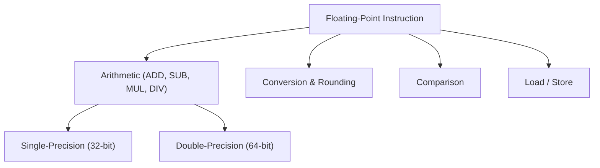

# 9. Floating Point & Advanced Math

Floating-point arithmetic is critical for scientific computing, graphics, machine learning, and digital signal processing. ARM provides dedicated floating-point units (FPUs) in both **VFP** (Vector Floating Point) and **NEON** SIMD extensions to accelerate these computations.

---

## 9.1 Floating-Point Instructions

ARM FPUs support operations on **single-precision (32-bit)** and **double-precision (64-bit)** values.

| Instruction Type  | Description                                    | Example               |
| ----------------- | ---------------------------------------------- | --------------------- |
| Arithmetic        | Add, Subtract, Multiply, Divide                | `FADD.S S0, S1, S2`   |
| Conversion        | Convert between integer and floating-point     | `VCVT.S32.F32 S0, S1` |
| Comparison        | Compare FP values for conditional execution    | `FCMP.S S0, S1`       |
| Move / Load/Store | Transfer FP values to/from registers or memory | `VSTR S0, [R0]`       |

---

## 9.2 Conversion, Rounding, and Saturation

* **Conversion:** Change representation between integer and FP formats.
* **Rounding:** Round FP results to nearest, toward zero, or toward ±infinity.
* **Saturation:** Clamp results to min/max limits to avoid overflow.

**Example: Rounding**

```asm
VCVT.S32.F32 S0, S1  ; Convert S1 float to 32-bit integer with rounding
```

---

## 9.3 Single vs Double Precision

* **Single-precision (32-bit):** Faster, uses less memory, sufficient for most DSP and graphics tasks.
* **Double-precision (64-bit):** Higher accuracy, used in scientific simulations and precise computations.

| Precision        | Size   | Use Case                    |
| ---------------- | ------ | --------------------------- |
| Single-precision | 32-bit | Graphics, ML inference, DSP |
| Double-precision | 64-bit | Scientific simulations, HPC |

---

## 9.4 NEON & FP Integration

* NEON SIMD can operate on FP vectors to process multiple FP numbers simultaneously.
* Example: 4 single-precision floats packed in a NEON register can be added in parallel.

**Example: NEON Vector FP Addition**

```asm
VADD.F32 Q0, Q1, Q2  ; Adds 4 floats in Q1 and Q2, stores result in Q0
```

---

## 9.5 Summary Flow Diagram



This chapter equips developers to leverage ARM FPUs and NEON SIMD for high-performance floating-point workloads efficiently.
